## Marks and Channels

:::: {.columns}

::: {.column width="50%"}

This lecture is based on Chapter 5 of *Visualization Analysis & Design*.

</br>

"Marks and Channels"

:::

::: {.column width="50%"}  

{width=75% fig-align=right .lightbox}\
 
:::

::::

## Marks and Channels

</br>

The goal of this chapter is to understand the basic geometric elements that depict items or links (**marks**) and control their appearance (**channels**).  

<center>

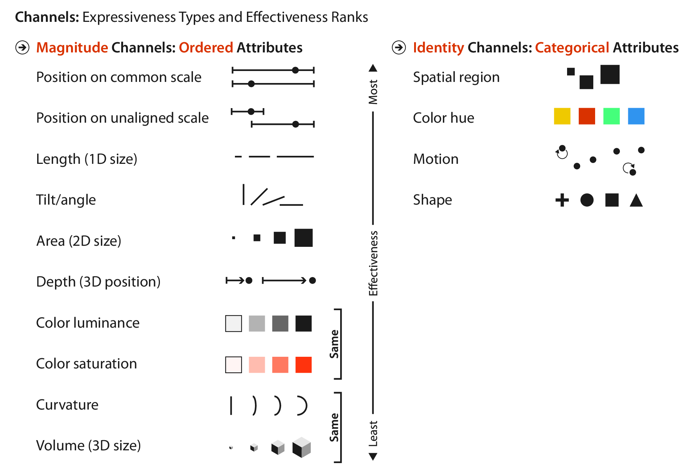{width=60% .lightbox}\

</center>

## Marks

- A **mark** is a basic graphical element in an image.
  - They are classified according to their spatial dimensions.
    - 0D: Point
    - 1D: Line
    - 2D: Area
    - 3D: Volume (uncommon)

<center>

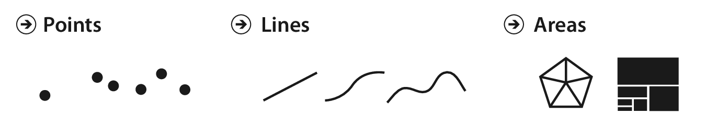{width=60% .lightbox}\

</center>

## Channels

- A visual **channel** is a way to control the appearance of a mark, independent of its dimensionality.

<center>

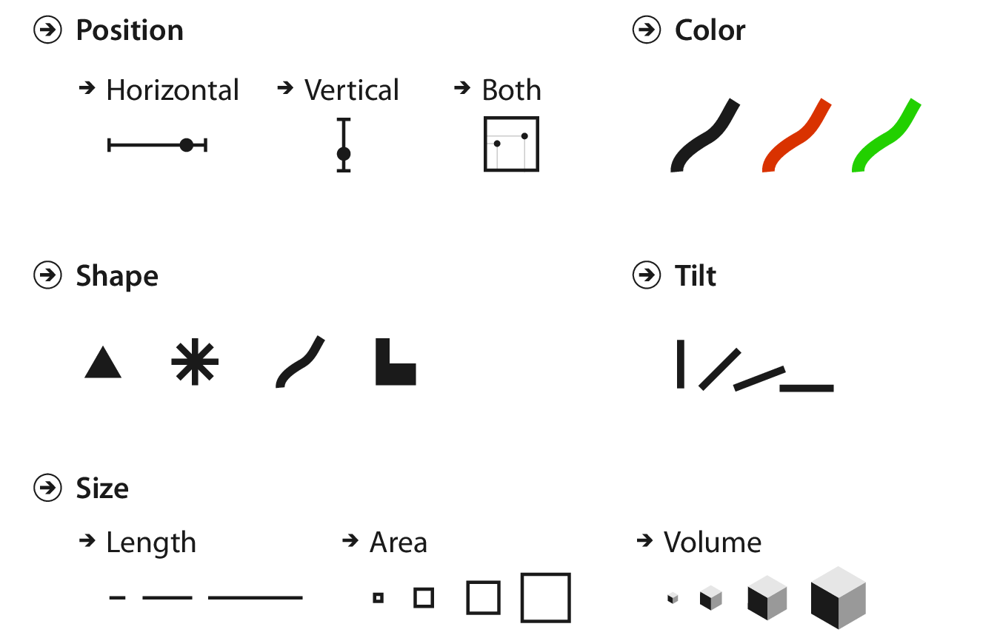{width=60% .lightbox}\

</center>

## Channels

This figure shows a progression of chart types, with each panel showing one more quantitative data attribute by adding one more visual channel. Each panel uses one mark (line or point).

- **Bar chart**: two attributes (vertical position quantitative, horizontal position categorical)
- **Scatterplot**: two quantitative attributes (vertical position, horizontal position)
- **Scatterplot with color**: three quantitative attributes (color is categorical)
- **Scatterplot with color and size**: four quantitative attributes (shape is quantitative)

<center>

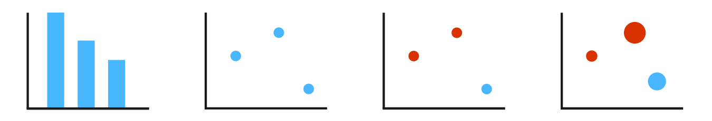{width=60% .lightbox}\

</center>

## Channels

</br>

<center>

{width=60% .lightbox}\

</center>

</br>

- In this figure, each channel shows one attribute.
- Multiple channels can be used to redundantly encode the same attribute.
  - This makes that attribute very easily perceived.
  - But it also "uses up" one of your channels.
  
## Channels

- Size and shape channels cannot be used on all types of marks.
  - Higher dimensional marks usually have intrinsic size/shape.
    - One notable exception is the [cartogram](https://en.wikipedia.org/wiki/Cartogram){target="blank"}.
  - Points and lines can be easily size coded.
  
  
<center>

{width=90% .lightbox}\

</center>

## Channel Types

- The human perceptual system has two fundamentally different kinds of sensory modalities.
  - The **identity** channels tell us information about *what* or *where* something is.
    - Referred to as "metathetic" or "what-where" in the psychophysics literature.
  - The **magnitude** channels tell us *how much* of something there is.
    - Referred to as "prothetic" or "how much" in the psychophysics literature.

## Mark Types

- Marks reprensent different things depending on the datatype.
  - For table datasets, a mark always represents an **item**.
  - For network datasets, a mark might represent either an **item** (node) or a **link**.
    - A **connection** mark shows a pairwise relationship between two items.
    - A **containment** mark shows hierarchical relationships using areas.
    
<center>

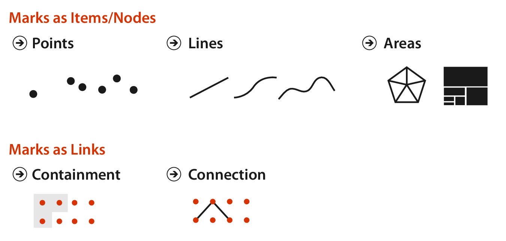{width=60% .lightbox}\

</center>

## Using Marks and Channels

- All channels are not equal!
- Encoding the same attribute with different visual channels will result in different information content in our heads after perception and processing.
- Use of marks and channels in idiom design should be guided by the principles of **expresiveness** and **effectiveness**.
- These principles can be combined to rank channels.

## Expressiveness and Effectiveness

- The **expressiveness principle** dictates that the visual encoding should express all of, and only, the inofrmation in the dataset attributes.
  - Ordered data should be shown in a way that we perceive as ordered.
  - Unordered data should *not* be shown in  a way that perceptually implies ordering.
- The **effectiveness principle** dictates that the importance of the attribute should match the **salience** of the channel.
  - The most important attributes should be encoded with the most effective channels.

## Channel Rankings

<center>

{width=80% .lightbox}\

</center>

## Channel Rankings

</br>

- *Note that*, while it is possible to use magnitude channels for categorical attributes or identity channels for ordered attributes, this is a violation of the **expressiveness principle**.


## Channel Rankings

- Both magnitude and identity channels have channels related to spatial position as the most effective.
  - Spatial position is the only channel on both lists.
  - This only applies to 2D position; 3D position (depth) is ranked much lower.
- The choice of which attributes to encode with spatial position is the most central choice in visualization encoding.
  - The attributes encoded with position will dominate the user's **mental model** compared with any other channel.

## Channel Effectiveness

- In analyzing the effectiveness of a visualization, you can ask many questions about the use of visual channels:
  - How are these channel rankings justified?
  - Why did the designer choose particular channels?
  - How many more visual channels are there?
  - What kinds of information and how much information can a channel encode?
  - Why are some channels better than others?
  - Can all channels be used independently, or do they interfere with each other?

## Accuracy

- An important part of effectiveness is **accuracy**, how close the human perceptual judgement is to some objective measure of the stimulus.
- **Psychophysics** is the subfield of psychology concerned with the measurement of human perception.
- Stevens[^1] presented the psychophysical power law relating the apparent magnitude of a sensory channel $(S)$ to the stimulus intensity $(I)$.

$$S = I^n$$

[^1]: [Stevens (1975)](https://doi.org/10.4324/9781315127675){target="blank"} is a textbook you can find a [free PDF of online](https://api.taylorfrancis.com/content/books/mono/download?identifierName=doi&identifierValue=10.4324/9781315127675&type=googlepdf){target="blank"}.

## Accuracy {.smaller}

:::: {.columns}

::: {.column width="30%"}

- The exponent for perception of length is $n=1$.
  - Perception matches objective measurement.
- The exponent for color saturation is $n>1$.
  - Perception is exaggerated above objective measurement.
- The exponent for area is $n<1$.
  - Perception is dampened below objective measurement.


:::

::: {.column width="70%"}


<center>

{width=100% .lightbox}\

</center>

:::

::::

## Accuracy {.smaller}

:::: {.columns}

::: {.column width="30%"}

- Experimental work by Cleveland and McGill[^2] rannked channel accuracy:
  - Aligned position against a common scale
  - Unaligned position
  - Line length
  - Angle
- Crowdsourced results by Heer and Bostock[^3] supported and extended these results.


:::

::: {.column width="70%"}


<center>

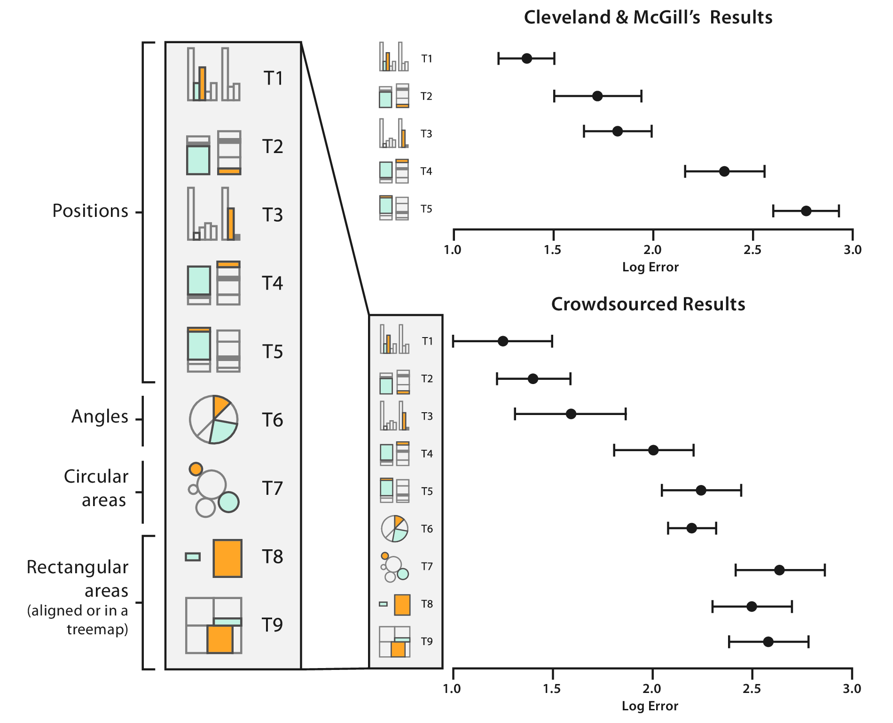{width=100% .lightbox}\

</center>

:::

::::

[^2]: [Cleveland and McGill (1984)](https://doi.org/10.1080/01621459.1984.10478080){target="blank"}
[^3]: [Heer and Bostock (2010)](https://doi.org/10.1145/1753326.1753357){target="blank"}

## Discriminability {.smaller}

:::: {.columns}

::: {.column width="40%"}
- **Discriminability** is the ability of a user to perceive the differences in a channel as intended.
  - This determines the number of **bins** that are available for a channel.
  - *E.g.*, linewidth has a limited number of discriminable bins.
    - Lines that are too thick effectively become polygons.
    - It is hard to perceive more than 3 or 4 linewidths.
    
:::

::: {.column width="60%"}
  
```{r}
#| echo: false
#| fig-width: 8
#| lightbox: true

# Load package
library(igraph)

# Create a random graph
set.seed(20260215)
g <- sample_gnm(8, 12)
# Layout
layout <- layout_with_fr(g)
# Edge weights
ew <- sample(c(2, 5, 8), size = 12, replace = TRUE)

# Plot
par(mar = c(0, 0, 0, 0),
    mai = c(0, 0, 0, 0))
plot(g, layout = layout, edge.width = ew, vertex.size = 30)
legend("bottomright", legend=c("high", "med", "low"), 
       col = c("gray"), 
       bty = "n", lwd = c(8, 5, 2), lty = 1, cex = 1, 
       horiz = FALSE, inset = c(0.05, 0.05))
```

:::

::::

## Separability

- Some channels interact with each other.
- There is a continuum from **separable** channels to **integral** channels.
  - **Separable** channels are completely independent from each other.
    - Straightfoward to use.
  - **Integral** channels are inextricably combined.
    - Visualizations can fail if these channels convey different attributes.
    
<center>

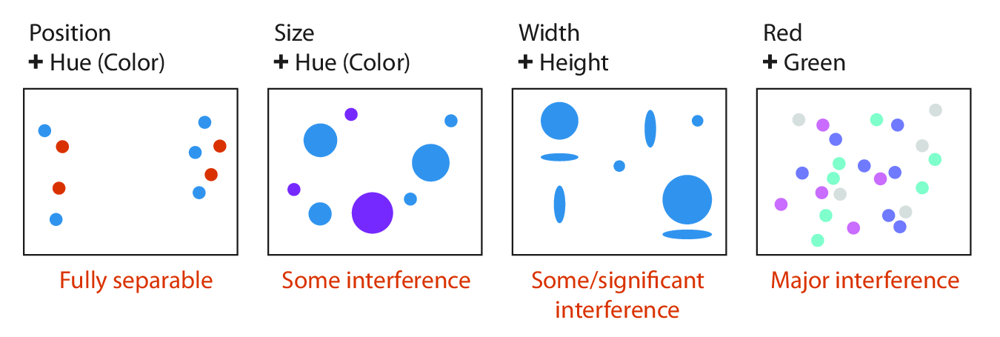{width=80% .lightbox}\

</center>

## Separability {.smaller}

<center>

{width=80% .lightbox}\

</center>

- Position + hue are fully separable. 
  - Clearly see 2 categories for both.
- Size + hue have some interference.
  - More difficult to tell the color on smaller objects.
- Width + height have significant interference.
  - You might see 3 groups (based on size) when there should be 4.
- Red + green have major interference.
  - The two colors combine to show us 4 different hues.

## Popout

- Many channels can provide **popout**, where a distinct item stands out immediately.

<center>

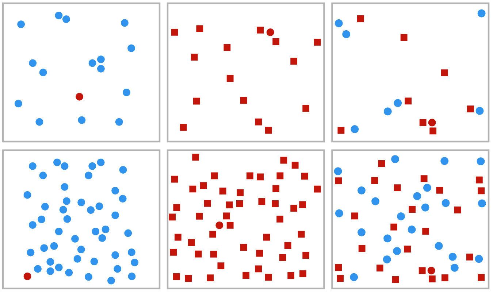{width=70% .lightbox}\

</center>

## Popout
<center>

:::: {.columns}

::: {.column}
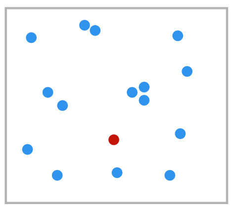{width=70% .lightbox}\
::: 

::: {.column}
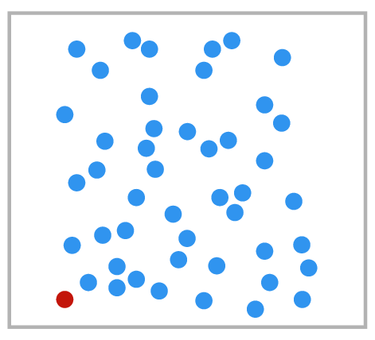{width=70% .lightbox}\
:::

::::

</center>

- The time it takes us to spot the red circle is roughly the same for 15 blue circles or 50 blue circles.
  - Our low-level visual system does "massively parallel processing" on color channels.
  
## Popout
<center>

:::: {.columns}

::: {.column}
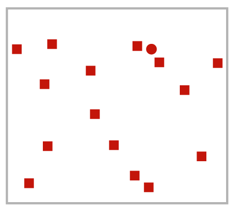{width=70% .lightbox}\
::: 

::: {.column}
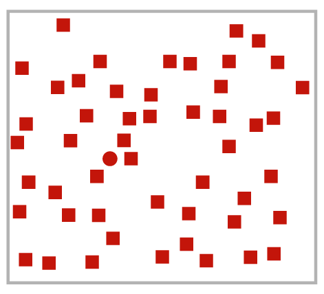{width=70% .lightbox}\
:::

::::

</center>

- The time it takes us to spot the red circle is roughly the same for 15 red circles or 50 red circles, but it is much slower than it was with the color difference.

## Popout
<center>

:::: {.columns}

::: {.column}
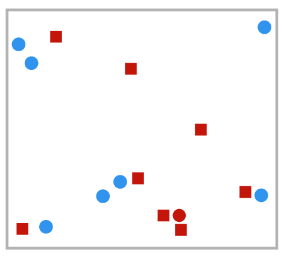{width=70% .lightbox}\
::: 

::: {.column}
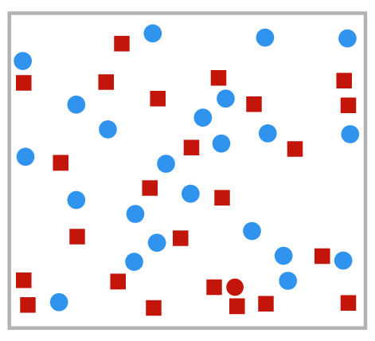{width=70% .lightbox}\
:::

::::

</center>

- Popout between channels can't necessarily be combined.
  - The red circle doesn't pop out when there are both shape and color differences.
  - It can only be detected by **serial search**, looking at each object one at a time.
    - Search time increases linearly with number of distractor objects.
    
## Popout

- Generally, you should only count on using popout for one channel at a time.
- Popout can occur for many channels.
  - Tilt (a), size (b), shape (c), proximity (d), shadow direction (e).
  - Note that parallel lines do not popout (f).
  
<center>

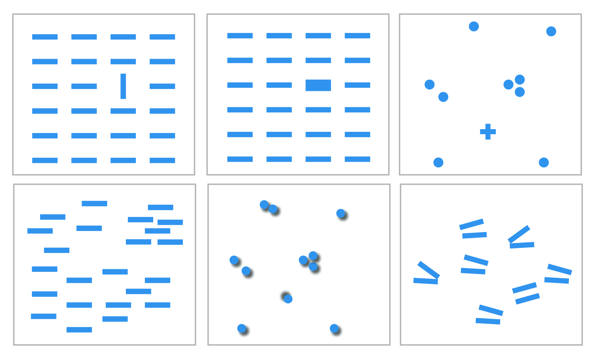{width=60% .lightbox}\

</center>


## Grouping

- You can convey information about grouping using:
  - Link marks
  - Identity channels
    - Proximity
    - Similarity

## Grouping

- You can convey information about grouping using link marks.
  - Areas of containment are the strongest cue.
  - Connection marks are the second best.
  
<center>

{width=60% .lightbox}\

</center>

## Grouping

- You can convey information about grouping using identity channels.
  - Proximity is the third strongest cue.
  - Similarity (in hue or motion) is the last cue.
  

## Relative vs. Absolute Judgements

- **Weber's Law** tells us that the human perceptual system is based on relative judgements, not absolute judgements.
- This holds true for all sensory modalities.

<center>

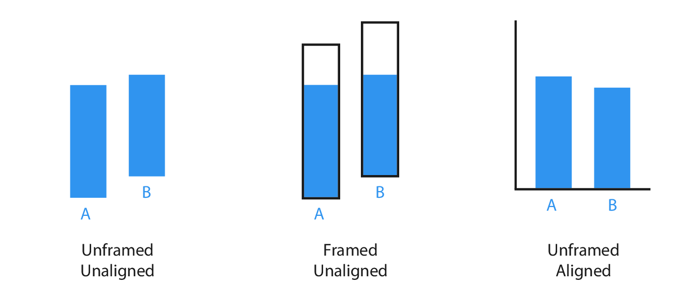{width=80% .lightbox}\

</center>


## Relative vs. Absolute Judgements

<center>

{width=80% .lightbox}\

</center>

- The lengths of unframed, unaligned rectangles of slightly different sizes are hard to compare.
- Adding a frame helps.
- Aligning the bars makes judgement easy.

## Relative vs. Absolute Judgements

This optical illusion by [Edward H. Adelson](https://persci.mit.edu/people/adelson){target="blank"} demonstrates that our perception of color and luminance is context-dependent.

<center>

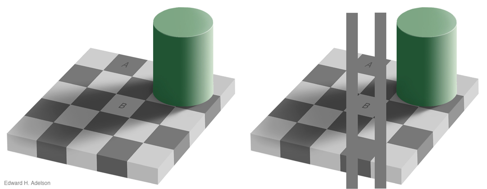{width=80% .lightbox}\

[[Perceptual Science Group @ MIT](https://persci.mit.edu/gallery/checkershadow/download/)]{style="font-size: 70%;"}

</center>


# Questions?

</br>

</br>


:::{style="font-size: 50%"}
[BCB5200 Home](https://bsmity13.github.io/BCB5200/)
:::
