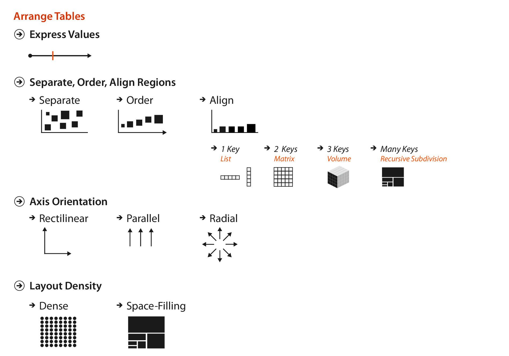
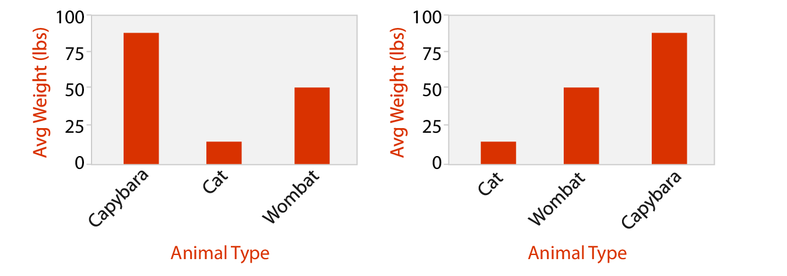
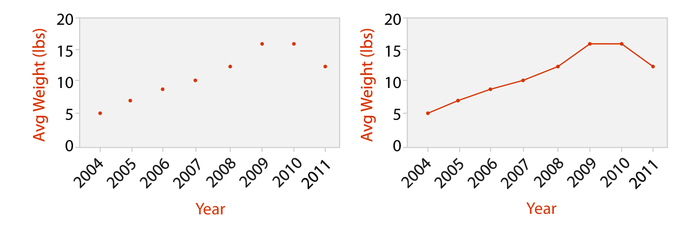
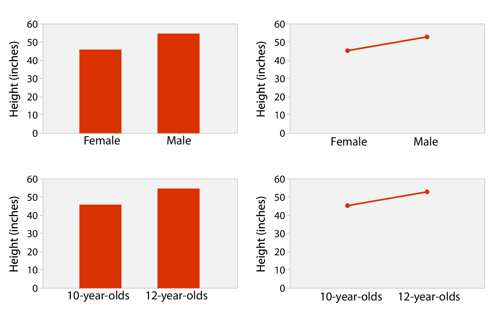
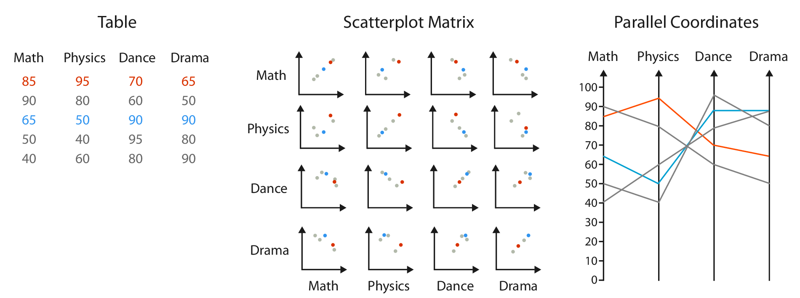
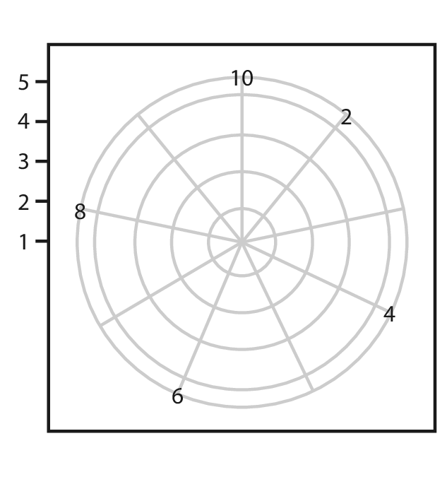
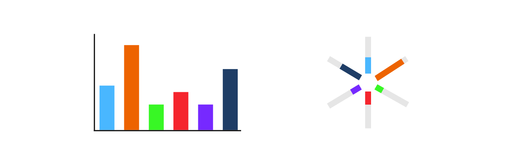

## Arranging Tables

:::: {.columns}

::: {.column width="50%"}

This lecture is based on Chapter 7 of *Visualization Analysis & Design*.

</br>

"Arrange Tables"

:::

::: {.column width="50%"}  

{width=75% fig-align=right .lightbox}\
 
:::

::::

## Arranging Tables

</br>

The goal of this chapter is to understand the visual encoding design choices for how to arrange tabular data spatially.  

<center>

{width=60% .lightbox}\

</center>

## Why Arrange?

- The **arrange** design choice covers all aspects of the use of spatial channels for visual encoding.
  - Use of space dominates the user's mental model, so it is the most important choice.
  - The three highest ranked [effectiveness channels](08_marks_channels.qmd#ch-rankings){target="_blank"} for quantitative and ordered attributes are all related to spatial position:
    - Planar position against a common scale
    - Planar position along an unaligned scale
    - Length
  - The highest ranked [effectiveness channel](08_marks_channels.qmd#ch-rankings){target="_blank"} for categorical data relates to spatial position.
    - There are no non-spatial channels effective for all attribute types
    
## Arrange by Keys and Values

- Attributes can be categorized as **key** or **value** attributes:
  - **Key** attributes are independent attributes that can be used as a unique index to lookup items.
    - Can be categorical or ordinal.
  - **Value** attributes are dependent attributes giving the value of a cell.
    - Can be any type.
    - Unique values of categorical or ordinal attributes are known as **levels**.
      - Avoid overloading the word *value*.
      - Same term used for `factor` variables in `R`.

## Arrange by Keys and Values

- Design choices relate directly to the semantics of the table attributes, the number of keys and the number of values.
- An idiom can show:
  - only values with no keys:
    - Scatter plot
  - one key and one value:
    - Bar chart
  - two keys and one value:
    - Heat map
  - many keys and many values:
    - Scatter plot matrix
    - Faceted scatter plot

## Express Quantitative Values

### Scatter Plot
*Two values, no keys*

```{r}
#| echo: true
#| code-fold: true
#| fig-width: 6
#| fig-height: 4.5
#| fig-align: center

library(dplyr)
library(ggplot2)
data("starwars")

starwars %>% 
  filter(mass < 500) %>% 
  ggplot(aes(x = height, y = mass)) +
  geom_point() +
  ggtitle("Scatter Plot", subtitle = "Star Wars data") +
  theme_classic()

```
## Express Quantitative Values

### Scatter Plots

</br>

```{r}
#| echo: false

sp_tab <- data.frame(Idiom = c("What: Data", 
                               "How: Encode",
                               "Why: Task",
                               "Scale"),
                     Scatterplots = c("Table: two quantitative value attributes",
                                      "Express values with horizontal and vertical spatial position and point marks",
                                      "Find trends, outliers, distribution, correlation, locate clusters",
                                      "Items: hundreds"))

knitr::kable(sp_tab)
```


## Express Quantitative Values

### Scatter Plots

- Good for finding trends.
  - Sometimes a trendline is superimposed.
- Color coding can show an additional attribute.
- Size coding can show yet another attribute.
  - Sometimes called a **bubble plot**.
  
## Separate, Order, and Align

### Categorical Regions

- The **principle of expressiveness** would be violated if we encoded categorical attributes with spatial position.
- Instead, we can use **spatial region**.
  - Regions are continuous, bounded areas that are distinct from each other.
  - Drawing items with the same level uses spatial proximity to encode their similarity.
    - Adheres to the expressiveness principle.
  - Still leaves flexibility for how to encoded information *within* a region.
  
## Separate, Order, and Align

### Categorical Regions

- Distributing regions involves three operations:
  - Separating into regions.
  - Aligning the regions.
  - Ordering the regions.
- Separating and ordering always happen.
- Alignment is optional.
- Separating should be done by the categorical attribute.
- Ordering and alignment should be done by an ordered attribute.

## Separate, Order, Align

- With one key, use **list alignment**.
- Results in one region per item.
- Arrangement can be horizontal or vertical.

## Separate, Order, Align

### Bar Chart
*One key, one value*

```{r}
#| echo: true
#| code-fold: true
#| fig-width: 6
#| fig-height: 4.5
#| fig-align: center

starwars %>% 
  filter(mass < 500,
         !is.na(gender)) %>% 
  group_by(gender) %>% 
  summarize(mass = mean(mass)) %>% 
  ggplot(aes(x = gender, y = mass)) +
  geom_col(width = 0.2) +
  coord_cartesian(expand = c(bottom = FALSE)) +
  ggtitle("Bar Chart", subtitle = "Star Wars data") +
  theme_classic()

```

## Separate, Order, Align

### Bar Charts

- Use a line mark, aligned in a common frame.
- Encode a quantitative attribute with spatial position.
- Encode a categorical attribute with spatial region.
- Ordering can default to alphabetical or be data-driven.

<center>
{width="80%"}
</center>

## Separate, Order, Align

### Bar Charts

</br>

```{r}
#| echo: false

bar_tab <- tibble(Idiom = c("What: Data", 
                               "How: Encode",
                               "Why: Task",
                               "Scale"),
                     `Bar Charts` = c("Table: one quantitative value attribute, one categorical key attribute",
                                      "Line marks, express values with aligned position, separate values with region",
                                      "Lookup and compare values",
                                      "Key attribute: dozens to hundreds of levels"))

knitr::kable(bar_tab)
```

## Separate, Order, Align

### Stacked Bar Charts

```{r}
#| echo: true
#| code-fold: true
#| fig-width: 6
#| fig-height: 4.5
#| fig-align: center
#| warning: false
#| message: false

starwars %>% 
  filter(mass < 500,
         !is.na(gender),
         hair_color %in% c("black", "blond", "brown")) %>% 
  mutate(gender = factor(gender),
         hair_color = factor(hair_color)) %>% 
  group_by(gender, hair_color) %>% 
  summarize(mass = sum(mass)) %>% 
  ggplot(aes(x = gender, y = mass, fill = hair_color)) +
  geom_col() +
  xlab("Gender") +
  ylab("Total Mass") +
  scale_fill_discrete(name = "Hair Color") +
  coord_cartesian(expand = c(bottom = FALSE)) +
  ggtitle("Stacked Bar Chart", subtitle = "Star Wars data") +
  theme_bw()

```

## Separate, Order, Align

### Stacked Bar Charts

</br>

```{r}
#| echo: false

st_bar_tab <- tibble(Idiom = c("What: Data", 
                               "How: Encode",
                               "Why: Task",
                               "Scale"),
                     `Stacked Bar Charts` = c("Multidimensional table: one quantitative value attribute, two categorical key attributes",
                                      "Bar glyph with length-coded subcomponents of value attribute for each category of secondary key attribute; separate bars by category of primary key attribute",
                                      "Part-to-whole relationship, lookup values, find trends",
                                      "Key attribute (main axis): dozens to hundreds of levels, Key attribute (stacked glyph axis): several to one dozen"))

knitr::kable(st_bar_tab)
```

## Separate, Order, Align

### Dot and Line Charts

- **Dot Chart**
  - Like a bar chart, but uses point marks (standard use); or, like a scatter plot, but one axis is *ordered* categories.
  - One quantitative attribute using spatial position, one ordered attribute using spatial region.
- **Line Chart**
  - A dot chart with lines connecting the dots to show trend.
  
<center>
{width="50%" .lightbox}\
</center>

## Separate, Order, Align

### Dot and Line Charts

```{r}
#| echo: false

dot_ch_tab <- tibble(Idiom = c("What: Data", 
                               "How: Encode"),
                     `Dot Charts` = c("Table: one quantitative value attribute, one ordered key attribute",
                                      "Express value attribute with aligned vertical position and point marks; separate/order into horizontal regions by key attribute"))

knitr::kable(dot_ch_tab)
```

## Separate, Order, Align

### Dot and Line Charts

```{r}
#| echo: false

line_ch_tab <- tibble(Idiom = c("What: Data", 
                               "How: Encode",
                               "Why: Task",
                               "Scale"),
                     `Line Charts` = c("Table: one quantitative value attribute, one ordered key attribute",
                                      "Dot chart with connection marks between dots",
                                      "Show trend",
                                      "Key attribute: hundreds of levels"))

knitr::kable(line_ch_tab)
```

## Separate, Order, Align

### Bar vs. Line Charts

- Bar charts encourage discrete comparisons.
- Line charts encourage trend assessment.
  - Should not be used for categorical (unordered) attributes (top right)
  
<center>
{width="60%" .lightbox}\
</center>

## Separate, Order, Align

### Matrix Alignment

- Distribute one key along rows and another along columns.
- **Heat maps** are the simplest example.
- Scatter Plot Matrices (SPLOMs) show all possible pairwise combinations.

## Separate, Order, Align

### Heat Map
*Two keys, one value*

```{r}
#| echo: true
#| code-fold: true
#| fig-width: 6
#| fig-height: 4.5
#| fig-align: center
#| warning: false
#| message: false

hm <- starwars %>% 
  filter(mass < 500,
         !is.na(gender),
         hair_color %in% c("black", "blond", "brown")) %>% 
  mutate(gender = factor(gender),
         hair_color = factor(hair_color)) %>% 
  group_by(gender, hair_color, .drop = FALSE) %>% 
  summarize(n = n()) %>% 
  ggplot(aes(x = gender, y = hair_color, fill = n)) +
  geom_tile() +
  coord_cartesian(expand = FALSE) +
  scale_fill_viridis_b() +
  ggtitle("Heat Map", subtitle = "Star Wars data") +
  theme_classic()

print(hm)

```

## Separate, Order, Align

### Heat Maps


```{r}
#| echo: false

hm_tab <- tibble(Idiom = c("What: Data", 
                               "How: Encode",
                               "Why: Task",
                               "Scale"),
                     `Heat Maps` = c("Table: two categorical key attributes, one quantitative value attribute",
                                      "2D matrix alignment of area marks, diverging color map",
                                      "Find clusters, outliers; summarize",
                                      "Items: one million; categorical attribute levels: hundreds; quantitative attribute levels: 3 - 11"))

knitr::kable(hm_tab)
```


## Separate, Order, Align

### Scatter Plot Matrix
*Many keys, many values*

```{r}
#| echo: true
#| code-fold: true
#| fig-width: 6
#| fig-height: 4.5
#| fig-align: center
#| warning: false
#| message: false

xx <- starwars %>% 
  filter(mass < 500,
         birth_year < 200) %>% 
  select(height, mass, birth_year)

plot(xx, main = "Scatter Plot Matrix", sub = "Star Wars data",
     pch = 16)

```

## Separate, Order, Align

### Scatter Plot Matrix


```{r}
#| echo: false

splom_tab <- tibble(Idiom = c("What: Data", 
                              "What: Derived", 
                               "How: Encode",
                               "Why: Task",
                               "Scale"),
                     `SPLOMs` = c("Table",
                                      "Ordered key attribute; list of original attributes",
                                  "Scatter Plots in 2D matrix alignment",
                                      "Find correlations, trends, outliers",
                                      "Attributes: one dozen; items: dozens to hundreds"))

knitr::kable(splom_tab)
```


## Separate, Order, Align

### Faceted Scatter Plot
*Many keys, many values*

```{r}
#| echo: true
#| code-fold: true
#| fig-width: 6
#| fig-height: 4.5
#| fig-align: center
#| warning: false
#| message: false

starwars %>% 
  filter(mass < 500,
         !is.na(gender),
         hair_color %in% c("black", "blond", "brown")) %>% 
  mutate(gender = factor(gender),
         hair_color = factor(hair_color)) %>% 
  ggplot(aes(x = height, y = mass)) +
  facet_grid(gender ~ hair_color) +
  geom_point() +
  coord_cartesian(expand = FALSE) +
  ggtitle("Faceted Scatter Plot", subtitle = "Star Wars data") +
  theme_bw()

```

## Spatial Axis Orientation

- Spatial axes can be oriented three ways:
  - Rectilinear
  - Parallel
  - Radial
  
## Spatial Axis Orientation

### Rectilinear Layouts

- The most common layouts in data viz.
- All the previous examples.
- Limited to two perpendicular axes.
  - Or at most, three, although depth is a low-precision channel.

## Spatial Axis Orientation

### Parallel Layouts

- Allow more than three attributes to be encoded with spatial position channel.
- **Parallel coordinates** plots are used to show many attributes.
- Use jagged lines that cross each axis exactly once.

<center>
{width="80%" .lightbox}
</center>

## Spatial Axis Orientation

### Parallel Layouts

- Use two spatial dimensions:
  - one to show a quantitative value,
  - the other to lay out the multiple axes.

<center>
{width="80%" .lightbox}
</center>

## Spatial Axis Orientation

### Parallel Layouts

- Patterns are easily seen between neighboring axes, but not easily for distant axes.
  - Ordering axes is a critical decision.
- These layouts have a long training time.
  - Most users are not familiar with these plots and don't have intuition about the patterns.
  - Often used in conjunction with more familiar idioms, such as scatter plots (i.e., multiple views).
  

## Spatial Axis Orientation

### Radial Layouts

- Items are distributed around a circle using the angle channel.
- Also uses one ore more linear spatial channels.
- Might imply one attribute is more important than another.

<center>
{width="40%" .lightbox}
</center>

## Spatial Axis Orientation

### Radial Layouts

- Natural coordinate system is **polar coordinates**.
  - One dimension is an angle.
  - The other dimension is a spatial position.
  - Mathematically completely equivalent to **Cartesian coordinates**.

<center>
{width="30%" .lightbox}
</center>

## Spatial Axis Orientation

### Radial Layouts

- While, mathematically, radial layout are equivalent to Cartesian coordinates, **perceptually**, they are not.
  - The angle channel is less accurately perceived than the rectilinear spatial position.
  - The angle channel is inherently cyclic.
    - Radial layouts may be more effective for showing periodic patterns.

## Spatial Axis Orientation

### Radial Layouts

```{r}
#| echo: true
#| code-fold: true
#| fig-width: 6
#| fig-height: 2.5
#| fig-align: center
#| warning: false
#| message: false

library(patchwork)

cyclic <- data.frame(x = seq(0, 2*pi, length.out = 300)) %>% 
  mutate(y = sin(4*x))

a <- ggplot(cyclic, aes(x = x, y = y)) +
  geom_line() +
  ggtitle("Rectilinear") +
  theme_bw()

b <- a +
  coord_polar() +
  scale_x_continuous(breaks = c(0, pi/2, pi, 3*pi/2, 2*pi),
                     labels = c("0", "π/2", "π", "3π/2", "2π")) +
  ggtitle("Radial")

a + b

```

::: {style="font-size: 50%;"}
Side note, the polar transformation is a key idea behind the [Fast Fourier Transform](https://en.wikipedia.org/wiki/Fast_Fourier_transform){target="_blank"}
:::

## Spatial Axis Orientation

### Radial Bar Charts

```{r}
#| echo: false

rad_bar_tab <- tibble(Idiom = c("What: Data", 
                               "How: Encode"),
                     `Radial Bar Charts` = c("Table: one quantitative attribute, one categorical attribute",
                                      "Length coding of line marks; radial layout"))

knitr::kable(rad_bar_tab)
```


## Spatial Axis Orientation

### Rectilinear vs. Radial Layouts

<center>
{width="80%"}
</center>


## Spatial Axis Orientation

### Pie Charts

```{r}
#| echo: true
#| code-fold: true
#| fig-width: 6
#| fig-height: 4.5
#| fig-align: center

pie <- starwars %>% 
  filter(hair_color  %in% c("black", "blond", "brown")) %>% 
  group_by(hair_color) %>% 
  summarize(n = n()) %>% 
  ggplot(aes(x = "", y = n, fill = hair_color)) +
  geom_bar(stat = "identity", width = 1) +
  coord_polar("y", start = 0) +
  xlab(NULL) + 
  ylab(NULL) +
  ggtitle("Pie Chart", subtitle = "Star Wars data") +
  theme_classic() +
  theme(axis.text.x = element_blank())
print(pie)
```

## Spatial Axis Orientation

### Pie Charts

```{r}
#| echo: false

pie_tab <- tibble(Idiom = c("What: Data", 
                               "Why: Task",
                               "How: Encode",
                               "Scale"),
                     `Pie Charts` = c("Table: one quantitative attribute, one categorical attribute",
                                      "Part-whole relationship",
                                      "Area marks (wedges) with angle channel; radial layout",
                                      "One dozen categories"))

knitr::kable(pie_tab)
```


## Spatial Axis Orientation

### Polar Area Charts

```{r}
#| echo: true
#| code-fold: true
#| fig-width: 6
#| fig-height: 4.5
#| fig-align: center

pa <- starwars %>% 
  filter(hair_color  %in% c("black", "blond", "brown")) %>% 
  group_by(hair_color) %>% 
  summarize(n = n()) %>% 
  ggplot(aes(x = hair_color, y = n, fill = hair_color)) +
  geom_col(width = 1) +
  coord_polar() +
  xlab(NULL) + 
  ylab(NULL) +
  ggtitle("Polar Area Chart", subtitle = "Star Wars data") +
  theme_classic() +
  theme(axis.text.x = element_blank())
print(pa)
```

## Spatial Axis Orientation

### Polar Area Charts

```{r}
#| echo: false

pa_tab <- tibble(Idiom = c("What: Data", 
                               "Why: Task",
                               "How: Encode",
                               "Scale"),
                     `Polar Area Charts` = c("Table: one quantitative attribute, one categorical attribute",
                                      "Part-whole relationship",
                                      "Area marks (wedges) with angle channel; radial layout",
                                      "One dozen categories"))

knitr::kable(pa_tab)
```

## Spatial Axis Orientation

### Polar Area Charts

- Pie charts require angle and area judgements.
- Polar area charts are a more direct equivalent of bar charts.

```{r}
#| echo: false
#| fig-align: center
#| fig-width: 7
#| fig-height: 2.5

pie + pa

```


# Questions?

</br>

</br>


:::{style="font-size: 50%"}
[BCB5200 Home](https://bsmity13.github.io/BCB5200/)
:::
