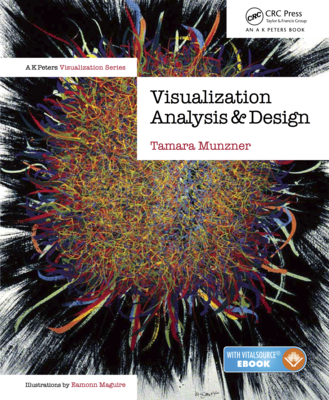
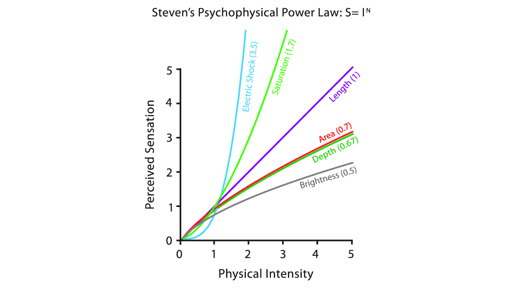
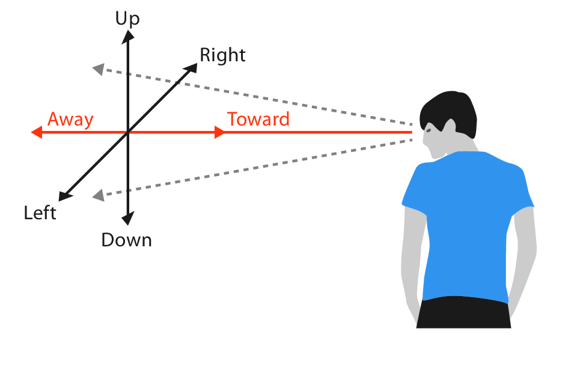
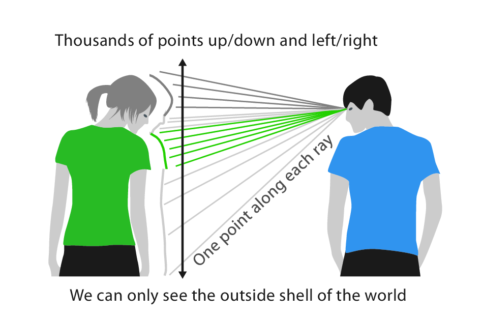

```{r, setup}
# Need this setup chunk to have `rgl` plot in slides
library(rgl)
knitr::knit_hooks$set(webgl = hook_webgl)
```

## Rules of Thumb

:::: {.columns}

::: {.column width="50%"}

This lecture is based on Chapter 6 of *Visualization Analysis & Design*.

</br>

"Rules of Thumb"

:::

::: {.column width="50%"}  

{width=75% fig-align=right .lightbox}\
 
:::

::::

## Rules of Thumb

</br>

This chapter contains advice and guidelines. Dr. Munzner says:

</br>

> "Each of them has a catchy title in hopes that you'll remember it as a slogan."

## Rules of Thumb

The 8 Rules of Thumb:

:::: {.columns}

::: {.column}

- No Unjustified 3D
  - The Power of the Plane
  - The Disparity of Depth
  - Occlusion Hides Information
  - Perspective Distortion Dangers
  - Tilted Text Isn't Legible
- No Unjustified 2D

:::

::: {.column}

- Eyes Beat Memory
- Resolution over Immersion
- Overview First, Zoom and Filter, Detail on Demand
- Responsiveness is Required
- Get it Right in Black and White
- Function First, Form Next

:::

::::

## No Unjustified 3D

</br>

- "If two dimensions are good, three dimensions must be better," is a common misconception.
  - Depth has important differences from the first two spatial dimensions.
  
## No Unjustified 3D

- 3D viz is easy to justify if the goal involves understanding the shape of inherently 3D structures (e.g., spatial data).

```{r}
#| echo: true
#| code-fold: true
#| fig-align: center

data("volcano")

# Exaggerate relief
z <- volcano * 3

# Plot
filled.contour(x = 1:nrow(z), y = 1:ncol(z), z = z, 
               main = "Maunga Whau Volcano", asp = 1)
```

::: {style="font-size: 50%;"}

See `?filled.contour` (base R).

:::

## No Unjustified 3D

- 3D viz is easy to justify if the goal involves understanding the shape of inherently 3D structures (e.g., spatial data).

```{r}
#| echo: true
#| code-fold: true
#| fig-align: center

x <- 10 * (1:nrow(z))   # 10 meter spacing (S to N)
y <- 10 * (1:ncol(z))   # 10 meter spacing (E to W)
## Don't draw the grid lines :  border = NA
par(bg = "slategray3",
    mar = c(0, 0, 3, 0))
persp(x, y, z, theta = 135, phi = 30, col = "green3", scale = FALSE,
      ltheta = -120, shade = 0.75, border = NA, box = TRUE,
       main = "Maunga Whau Volcano")

```

::: {style="font-size: 50%;"}

See `?persp` (base R).

:::

## No Unjustified 3D

- 3D viz is easy to justify if the goal involves understanding the shape of inherently 3D structures (e.g., spatial data).

```{r, volcano, webgl=TRUE}
#| echo: true
#| code-fold: true
#| fig-align: center
#| message: false
#| warning: false

library(rgl)

z <- 3 * volcano        # Exaggerate the relief

x <- 10 * (1:nrow(z))   # 10 meter spacing (S to N)
y <- 10 * (1:ncol(z))   # 10 meter spacing (E to W)

zlim <- range(z)
zlen <- zlim[2] - zlim[1] + 1

colorlut <- terrain.colors(zlen) # height color lookup table

col <- colorlut[ z - zlim[1] + 1 ] # assign colors to heights for each point

par3d(windowRect = c(34, 57, 727, 707))
surface3d(x, y, z, color = col, back = "lines")

```


::: {style="font-size: 50%;"}

See `?surface3d` (package `rgl`).

:::

## No Unjustified 3D

</br>

- In all other cases, the use of 3D needs to be carefully justified.
- Mostly, a better choice will be to use only 2 spatial dimensions following some data abstraction.

## No Unjustified 3D

</br>

- We judge depth based on cues:
  - Occlusion
  - Perspective distortion
  - Shadows and lighting
  - Familiar size
  - Stereoscopic disparity
  - Others
  
## No Unjustified 3D

### The Power of the Plane

- Vertical and horizontal spatial position are categorized as *planar* because the differences between up-down and left-right are subtle.
  - We do actualy perceive height as more important than horizontal position.
  - But aspect ratio of most displays give more horizontal space, overcoming this.
  - Left-right ordering is probably prioritized based on culture, with most Western languages being read left-to-right.
  
## No Unjustified 3D

### The Disparity of Depth

- We judge depth less accurately than the planar spatial positions.

<center>
{width=70%}
</center>

## No Unjustified 3D

### The Disparity of Depth

- Lines that extend into scenes are scaled non-linearly, while the other two are perfectly linear.

<center>
{width=50%}
</center>

## No Unjustified 3D

### The Disparity of Depth

- According to Colin Ware ([Ware 2008](https://www.researchgate.net/publication/200027485_Visual_Thinking_For_Design){target="_blank"}), we *see* in 2.05D, since the majority of the information is in the **image plane** and we see very little depth.
  - The 0.05 is an arbitrary small number.

<center>
{width=50%}
</center>

## No Unjustified 3D

### The Disparity of Depth

- We can see millions (?) of rays along the *planar axes* by simply moving our eyes.
- We only get information about depth at one point along each ray.
  - This is known as **line-of-sight ambiguity**.

<center>
{width=50%}
</center>

## No Unjustified 3D

### Occlusion Hides Information

- **Occlusion** is the most powerful depth cue, where some objects are hidden behind others.
- Occlusion relationships between objects change as we move, known as **motion parallax**.
  - This allows us to build an understanding of relative distances between each other.
  
## No Unjustified 3D

### Occlusion Hides Information

- Occlusion is less effective in static 2D scenes. 
  - Interactive navigation lets us use motion parallax to understand depth.
  
```{r, volcano2, webgl=TRUE}
#| echo: false
#| fig-align: center
#| message: false
#| warning: false
#| fig-width: 8
#| fig-height: 6


par3d(windowRect = c(34, 57, 727, 707))
surface3d(x, y, z, color = col, back = "lines")

```

## No Unjustified 3D

### Occlusion Hides Information

- Occlusion in realistic scenes (like `volcano`) is rarely a problem.
  - Often unnecessary to view every angle.
- But in data viz, an occluded detail might be critical.

## No Unjustified 3D

### Occlusion Hides Information

- If objects have unpredictable and unfamiliar shapes, it can be very challenging to understand the 3D-structure of the scene.

<center>
{width=40% .lightbox}\
</center>

::: {style="font-size: 50%;"}

[https://jevansbio.wordpress.com/2019/05/29/plotting-networks-in-blender/](https://jevansbio.wordpress.com/2019/05/29/plotting-networks-in-blender/)

:::


## No Unjustified 3D

### Perspective Distortion Dangers

- **Perspective distortion** is that distant objects appear smaller and change their planar position on the image plane.
  - Important discovery in Western art by Renaissance mathematicians and painters.
  - So, many people think of perspective as a *good thing*.
- But for visually encoding data, **perspective distortion** is a *bad thing*.
  - E.g., bars on a 3D bar chart are harder to judge.

## No Unjustified 3D

### Other Depth Cues

- Familiar objects
  - E.g., we roughly know the size of a car, so when we see a car far away, it helps us judge the size of other objects.
  - For abstract information (i.e., data), we don't have these cues.
  
## No Unjustified 3D

### Other Depth Cues

- Shadows and surface shading
  - Convey information about depth and shape.
  - Also create visual clutter, distracting from the meaningful data.
  - Can occlude true marks.
  - Can interfere with color channels.
  
## No Unjustified 3D

### Other Depth Cues

- **Stereoscopic depth** is a cue that comes from the disparities between two images made from camera viewpoints slightly separated in space.
  - Like the separation of our eyes.
  - Stereo vision is actually a relatively weak cue, useful for manipulating objects within arm's reach.
  - Stereo displays exist, but do not resolve problems with perspective.
  
## No Unjustified 3D

### Other Depth Cues

- **Atmospheric perspective** is where distant objects are shifted slightly towards blue.
  - Relatively subtle cue.
  - Interferes with color channels.
  
## No Unjustified 3D

### Tilted Text Isn't Legible

- Text fonts are designed for maximum legibility on the 2D grid of screen pixels.
- Tilted labels can become blocky and jagged.
- High-resoultion displays help with this.

## No Unjustified 2D

</br>

- Similarly, laying out data in 2D should be justified.
- Why use 2D when a list layout works well?

## No Unjustified 2D

- Lists have strengths:
  - They can show the maximal amount of information in the minimal amount of space.
  - When used in a way that takes up space, they can have notably lower information density.
  - Excellent for lookup tasks, where labels can be ordered appropriately.
    - E.g., alphabetically.
    
## Eyes Beat Memory

- Using our eyes to switch between views (e.g., panels) has a much lower cognitive load than consulting our memory to compare a current view to what was seen below.
- Interactive displays usually implicitly rely on memory.
  - A small overview window can help keep track of navigation.

## Eyes Beat Memory

### Memory and attention

- Broadly speaking, we have two categories of memory:
  - **Long-term memory**
    - Can last up to a lifetime
    - No strict upper limit
  - **Working memory**
    - Lasts several seconds
    - Very limited resource
    - When we experience **cognitive load**, we will fail to absorb further information
    
## Eyes Beat Memory

### Memory and attention

- Our attention also has "severe" limits.
  - Conscious search for items grows more difficult with the number of items to be checked.
  - Vigilance also degrades with time, meaning we're worse at searching after a couple of hours than we are at the start of a task.
  
## Eyes Beat Memory

### Animation vs. Side-by-Side

- Some animation idioms impose significant cognitive load because of implicit memory demands.
- Animation can work well in narrative story telling (e.g., movies).
  - Successfully storytelling deliberately controls the action and directs attention.
  - Data views often have multiple changes at once.
- Animation is extremely powerful when used for transitions between two dataset configurations.
  - Helps the user maintain context.
  - More effective than jump cuts.
  
<center>
*We will talk specifically about animation later in the semester.*
</center>

## Eyes Beat Memory

### Change Blindness

</br>

> "Our visual system works so well that most people have the intuition that we have detailed internal memory of our visual field. **However, we do not**."

## Eyes Beat Memory

### Change Blindness

- [**Change blindness**](https://en.wikipedia.org/wiki/Change_blindness){target="_blank"} occurs when we fail to detect even quite drastic changes to a scene if our attention is directed elsewhere.

> "For example, experimenters set up a real-world interactoin where somebody was engaged by a stranger who asked directions, only to be interrupted by people carrying a door who barged in between them. The experimenters orchestrated a switch during this visual interruption, replacing the questioner with another person. Remarkably, most people did not notice, even when the new questioner was dressed completely differently — or was a different gender tahn the old one!"

## Resolution over Immersion

- "Pixels are precious"
  - Resolution is far more important than immersion.
- Immersive environments emphasize realism and perception.
- Displays focused on immersion (e.g., virtual reality devices) often have low resolution.
  - *Technology might have advanced now, but this doesn't seem relevant to us.*
  
## Overview First, Zoom and Filter, Details on Demand

- Mantra of Ben Shneiderman ([Shneiderman 1996](https://doi.org/10.1016/B978-155860915-0/50046-9){target="_blank"})
- An **overview** gives the user broad awareness of the entire information space.
  - Goal is to *summarize*.
  - Useful at the beginning of exploration.
- Zooming and filtering can make it easier to display all the information at once.

## Overview First, Zoom and Filter, Details on Demand

```{r}
#| echo: true
#| code-fold: true
#| fig-align: center
#| fig-width: 12
#| fig-height: 7

library(leaflet)
library(amt) # animal movement tools

# Data on the mesocarnivore "fisher"
data("amt_fisher")

# Creates a leaflet map
inspect(amt_fisher)

```

## Overview First, Zoom and Filter, Details on Demand

- This mantra is useful for moderately-sized datasets.
- For larger datasets, an alternative is **"Search, Show Context, "Expand on Demand"**.
  - Search results provide the starting point.
  - [Van Ham and Perer 2009](https://doi.org/10.1109/TVCG.2009.108){target="_blank"}
  
## Responsiveness is Required

- The **latency** of interaction is how much time it takes for the system to respond to user action.
- Matters immensely for interaction design.
- *Largely irrelevant to us in this class*.

## Get it Right in Black and White

- Advocated by Maureen Stone (Stone 2010, but see also [this blog](https://www.tableau.com/blog/how-maureen-stone-makes-data-more-accessible-tableau-research){target="_blank"}).
- Ensure most crucial aspects of visual representation are legible even if the image is transformed to B&W.
  - Use luminance first.
  - Use hue/saturation as secondary channels.
  
## Function First, Form Next

- We want our visualizations to shine in both form (beauty) and function (effectiveness).
- Nevertheless, focus on function first.
- Easier to improve an ugly design than maintain form while changing function.
  - Often beautiful but ineffective designs need to be started over from scratch.

# Questions?

</br>

</br>


:::{style="font-size: 50%"}
[BCB5200 Home](https://bsmity13.github.io/BCB5200/)
:::
