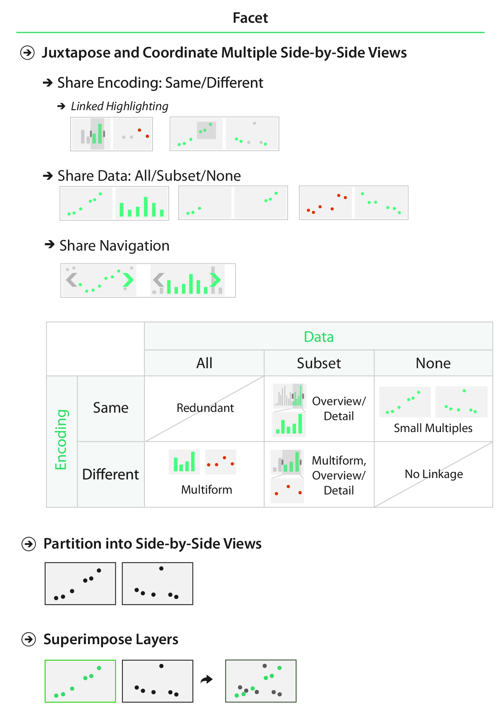
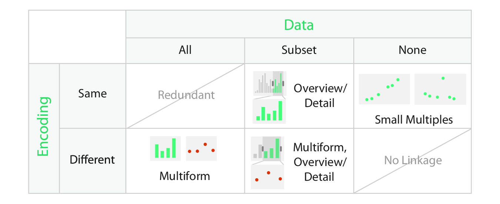

```{r, setup}
#| include: false

library(ggplot2)
library(dplyr)
library(patchwork)

```

## Multiple Views

:::: {.columns}

::: {.column width="50%"}

The beginning of this lecture is based on Chapter 12 of *Visualization Analysis & Design*.

</br>

"Facet into Multiple Views"

</br>

For this lecture, I'm going to start with some principles from the *VAD* Text, then transition over to creating multi-panel figures in R.

:::

::: {.column width="50%"}  

{width=75% fig-align=right .lightbox}\
 
:::

::::

## Facet into Multiple Views

<center>
{.lightbox width=35%}
</center>

## Facet into Multiple Views

### Decisions to Make

- Juxtapose or superimpose?
- Share encoding or use different encoding?
  - Use linked highlighting?
- Share data or show different data?
  - All
  - Some
  - None
- ~~Share navigation?~~

## Juxtapose or Superimpose?
```{r}
#| echo: false
#| fig-align: center

set.seed(20260304)

a <- data.frame(set = "a",
                x = runif(n = 15)) %>% 
  mutate(y = rnorm(n = nrow(.), 
                   mean = 0 + 2 * x,
                   sd = 0.25))

b <- data.frame(set = "b",
                x = runif(n = 15)) %>% 
  mutate(y = rnorm(n = nrow(.), 
                   mean = 2 - 2 * x,
                   sd = 0.25))

c <- rbind(a, b)

ggplot(c, aes(x = x, y = y)) +
  facet_wrap(~ set) +
  geom_point(size = 2) +
  ggtitle("Juxtapose") +
  theme_bw()
```

## Juxtapose or Superimpose?

```{r}
#| echo: false
#| fig-align: center

set.seed(20260304)

a <- data.frame(set = "a",
                x = runif(n = 15)) %>% 
  mutate(y = rnorm(n = nrow(.), 
                   mean = 0 + 2 * x,
                   sd = 0.25))

b <- data.frame(set = "b",
                x = runif(n = 15)) %>% 
  mutate(y = rnorm(n = nrow(.), 
                   mean = 2 - 2 * x,
                   sd = 0.25))

c <- rbind(a, b)

ggplot(c, aes(x = x, y = y, color = set)) +
  geom_point(size = 2) +
  ggtitle("Superimpose") +
  theme_bw()
```

## Juxtapose or Superimpose?

:::: {.columns}

::: {.column width=45%}

### Juxtapose

- Easy to compare ("Eyes beat Memory").
- Can use a different encoding for each one.
  - Can support multiple tasks.
- Each facet gets a fraction of the space.
  - Two facets get only half the display area each.

:::

::: {.column width=5%}

:::

::: {.column width=45%}

### Superimpose

- Easy to compare ("Eyes beat Memory").
- Constrains choices for visual encoding.
  - The two facets must be visually distinguishable layers.
  - Usually limited to 2 or 3 layers.
- Does not require more display area.

:::

::::

## Share Encoding?

```{r}
aa <- ggplot(a, aes(x = x, y = y)) +
  geom_point(size = 2) +
  coord_cartesian(xlim = c(0, 1),
                  ylim = c(0, 2)) +
  theme_bw()
bb <- ggplot(b, aes(x = x, y = y)) +
  geom_point(size = 2) +
  coord_cartesian(xlim = c(0, 1),
                  ylim = c(0, 2)) +
  theme_bw()

aa + bb + plot_annotation(title = "Shared Encoding Views")

```

## Share Encoding?

```{r}
aaa <- ggplot(a, aes(x = x, y = y)) +
  geom_point(size = 2, show.legend = FALSE) +
  coord_cartesian(xlim = c(0, 1),
                  ylim = c(0, 2)) +
  theme_bw()
bbb <- ggplot(a, aes(x = x)) +
  geom_histogram(color = "black", fill = "gray90",
                 binwidth = 0.1,
                 show.legend = FALSE) +
  theme_bw()

aaa + bbb + plot_annotation(title = "Multiform Views")

```

## Share Encoding?

```{r}
aaaa <- ggplot(a, aes(x = x, y = y, color = factor(x > 0.75))) +
  geom_point(size = 2, show.legend = FALSE) +
  scale_color_manual(values = c("black", "hotpink")) +
  coord_cartesian(xlim = c(0, 1),
                  ylim = c(0, 2)) +
  theme_bw()
bbbb <- ggplot(a, aes(x = x, fill = factor(x > 0.75))) +
  geom_histogram(color = "black", 
                 binwidth = 0.1,
                 show.legend = FALSE) +
  scale_fill_manual(values = c("gray90", "hotpink")) +
  theme_bw()

aaaa + bbbb + plot_annotation(title = "Multiform Views",
                            subtitle = "with Linked Highlighting")

```


## Share Encoding?

:::: {.columns}

::: {.column width=45%}

### Shared Encoding

- All channels have an identical visual encoding.
  - Simple to understand each panel.

:::

::: {.column width=5%}

:::

::: {.column width=45%}

### Multiform

- Some, but not all channels are shared.
  - Could share one spatial dimension but not another.
  - Could use different marks or channels.
- Linked highlighting can be useful to show corresponding data in both views.
  - Particularly useful in an interactive setting.

:::

::::

## Share Data?

- **Shared data** (all): both views show all the data.

```{r}
# Shared data

sh_a <- ggplot(mtcars, aes(x = disp, y = mpg, color = factor(cyl))) +
  geom_point(size = 2) +
  xlab("Displacement") +
  ylab("Gas Mileage") +
  scale_color_discrete(name = "Cylinders") +
  theme_bw()

sh_b <- ggplot(mtcars, aes(x = hp, y = mpg, color = factor(cyl))) +
  geom_point(size = 2) +
  xlab("Horsepower") +
  ylab("Gas Mileage") +
  scale_color_discrete(name = "Cylinders") +
  theme_bw()

sh_a + sh_b + plot_layout(guides = "collect") & theme(legend.position = "bottom")

```

## Share Data?

- **Overview-detail** (some): one view shows all the data, the other shows detail.

```{r}
# Overview-detail

od_a <- mtcars %>% 
  ggplot(aes(x = disp, y = mpg, color = factor(cyl))) +
  geom_point(size = 2) +
  xlab("Displacement") +
  ylab("Gas Mileage") +
  scale_color_manual(name = "Cylinders",
                     values = c("salmon", "green3", "steelblue")) +
  theme_bw()

od_b <- mtcars %>% 
  filter(cyl == 8) %>% 
  ggplot(aes(x = disp, y = mpg)) +
  geom_point(size = 2, color = "steelblue") +
  xlab("Displacement") +
  ylab("Gas Mileage") +
  theme_bw()

od_a + od_b & theme(legend.position = "top")

```

## Share Data?

- **Small multiples** (none): one view shows one subset, the other shows a different subset.

```{r}
# Small multiples

sm_a <- mtcars %>% 
  filter(cyl == 4) %>% 
  ggplot(aes(x = disp, y = mpg)) +
  geom_point(size = 2) +
  xlab("Displacement") +
  ylab("Gas Mileage") +
  ggtitle("4 cylinders") +
  theme_bw()

sm_b <- mtcars %>% 
  filter(cyl == 6) %>% 
  ggplot(aes(x = disp, y = mpg)) +
  geom_point(size = 2) +
  xlab("Displacement") +
  ylab("Gas Mileage") +
  ggtitle("6 cylinders") +
  theme_bw()

sm_c <- mtcars %>% 
  filter(cyl == 8) %>% 
  ggplot(aes(x = disp, y = mpg)) +
  geom_point(size = 2) +
  xlab("Displacement") +
  ylab("Gas Mileage") +
  ggtitle("8 cylinders") +
  theme_bw()

sm_a + sm_b + sm_c

```

## Share Encoding/Data?

<center>

</center>

# Multi-panel Figures in R

## Multi-panel Figures in R

- There are *many* ways to compose multi-panel figures in R, including methods using base R graphics, `ggplot2`, accessory packages for `ggplot2` objects, and other packages.

- We're just scratching the surface here, but I want to give you three different tools to get started with:
  - base R multi-panel plots,
  - faceting with `ggplot2`,
  - composing multi-panel plots with `patchwork`.
- Some other packages you might want to look into:
  - [`gtable`](https://gtable.r-lib.org/){target="_blank"}
  - [`cowplot`](https://github.com/wilkelab/cowplot){target="_blank"}
  - [`gridExtra`](https://github.com/baptiste/gridextra/wiki){target="_blank"}
  
# Multi-panel: base R

## Multi-panel: base R

- Two methods for creating multi-panel figures using base R:
  - Set graphical parameters using `par()`,
  - Use `layout()`.

## Multi-panel: base R `par()`

- Graphics devices in R have default graphical parameters.
- You can print those parameters with `par()` (no arguments).
- You can also change those parameters with `par()` (by adding arguments).

```{r}
#| echo: true

par()
```

## Multi-panel: base R `par()`

- If you're going to change the parameters inside a function, it is best practice to store and restore the defaults.

```{r}
#| echo: true
#| eval: false

my_fun <- function(...) {
  opar <- par(no.readonly = TRUE)
  
  # Do the things for the function here
  
  # When you're done, reset parameters:
  par(opar)
}
```

## Multi-panel: base R `par()`

- To create a multi-panel figure, change the graphical parameters `mfrow` or `mfcol`.
  - Specifies the number of rows and columns in the display: `c(nr, nc)`
  - Multiple calls to `plot()` are drawn in subsequent rows/columns
    - `mfrow` causes the plots to be drawn by rows
    - `mfcol` causes the plots to be drawn by columns
    
```{r}
#| echo: true
#| code-fold: true
#| fig-align: center

par(mfrow = c(1, 2))
plot(rnorm(100))
hist(rnorm(100))

```

## Multi-panel: base R `par()`

- Use of `mfrow`

```{r}
#| echo: true
#| code-fold: true
#| fig-align: center

par(mfrow = c(3, 2))
plot(rnorm(100), main = "Plot 1")
hist(rnorm(100), main = "Plot 2")
plot(rnorm(100), main = "Plot 3")
hist(rnorm(100), main = "Plot 4")
plot(rnorm(100), main = "Plot 5")
hist(rnorm(100), main = "Plot 6")

```

## Multi-panel: base R `par()`

- Use of `mfcol`

```{r}
#| echo: true
#| code-fold: true
#| fig-align: center

par(mfcol = c(3, 2))
plot(rnorm(100), main = "Plot 1")
hist(rnorm(100), main = "Plot 2")
plot(rnorm(100), main = "Plot 3")
hist(rnorm(100), main = "Plot 4")
plot(rnorm(100), main = "Plot 5")
hist(rnorm(100), main = "Plot 6")

```

## Multi-panel: base R `layout()`

- Using `layout()` allows finer control over the layout using a matrix.
  - For example, you can allow a single plot to take up multiple slots.

```{r}
#| echo: true
#| code-fold: true
#| fig-align: center

mat <- matrix(c(1, 2, 3, 3), nrow = 2, ncol = 2, byrow = TRUE)
layout(mat)

plot(rnorm(100), main = "Plot 1")
hist(rnorm(100), main = "Plot 2")
plot(rnorm(100), main = "Plot 3")

```

## Multi-panel: base R `layout()`

- There is also function `layout.show()` which will show the current layout for planning something complex.
  
```{r}
#| echo: true
#| code-fold: true
#| fig-align: center

mat <- matrix(c(1, 2, 3, 3), nrow = 2, ncol = 2, byrow = TRUE)
layout(mat)

# Can be useful to show how paging will occur if n > max(mat)
layout.show(n = 3)

```

# Faceting with `ggplot2`

## Faceting with `ggplot2`

- We've already seen some examples of using the `facet_*()` functions in `ggplot2`.
- Let's make sure we make the different options clear here.
  - `facet_wrap()`
  - `facet_grid()`
  - `facet_null()` (for the sake of completeness)
  
## Faceting with `ggplot2`

- `facet_wrap()` wraps a 1D sequence of panels to fit in the window.

```{r}
#| echo: true
#| code-fold: true
#| fig-align: center

expand.grid(n = 1:20, label = LETTERS[1:3]) %>% 
  mutate(x = rnorm(nrow(.))) %>% 
  ggplot(aes(x = x)) +
  geom_density(fill = "lavender") +
  facet_wrap(~ label)

```

## Faceting with `ggplot2`

- `facet_grid()` forms a matrix of panels defined by rows and columns.

```{r}
#| echo: true
#| code-fold: true
#| fig-align: center

expand.grid(n = 1:20, row = LETTERS[1:3], col = letters[1:3]) %>% 
  mutate(x = rnorm(nrow(.))) %>% 
  ggplot(aes(x = x)) +
  geom_density(fill = "lavender") +
  facet_grid(row ~ col)

```

## Faceting with `ggplot2`

- `facet_null()` means no faceting, and can be used to override one of the others.

```{r}
#| echo: true
#| code-fold: true
#| fig-align: center

pp <- expand.grid(n = 1:20, row = LETTERS[1:3], col = letters[1:3]) %>% 
  mutate(x = rnorm(nrow(.))) %>% 
  ggplot(aes(x = x)) +
  geom_density(fill = "lavender") +
  facet_grid(row ~ col)

pp + facet_null()

```

# Composing with `patchwork`

## Composing with `patchwork`

</br>

> The goal of `patchwork` is to make it ridiculously simple to combine separate ggplots into the same graphic...

[`patchwork`](https://patchwork.data-imaginist.com/){.external target="_blank"}


## Composing with `patchwork`

- The main thing that makes it "ridiculously simple" is the arithmetic operators to combine plots.
  - Combine in a row with `+`
  - Combine in a column with `/`
  - Group plots to increase complexity with `()`
  
## Composing with `patchwork`

- Create 3 plots, named `p1`, `p2`, and `p3` to demonstrate.

```{r}
#| echo: true
#| output: false
#| message: false
#| warning: false

p1 <- starwars %>% 
  filter(!is.na(gender)) %>% 
  ggplot() +
  geom_boxplot(aes(x = gender, y = height))

p2 <- starwars %>% 
  filter(mass < 500) %>% 
  ggplot() +
  geom_point(aes(x = height, y = mass))

p3 <- starwars %>% 
  filter(!is.na(birth_year)) %>% 
  ggplot() +
  geom_density(aes(x = birth_year), fill = "#ff000050")

```

## Composing with `patchwork`

- Combine in a row with `+`

```{r}
#| echo: true
#| warning: false
#| message: false
#| fig-align: center

p1 + p2

```

## Composing with `patchwork`

- Combine in a column with `/`

```{r}
#| echo: true
#| warning: false
#| message: false
#| fig-align: center


p1 / p2

```


## Composing with `patchwork`

- Group plots to increase complexity with `()`

```{r}
#| echo: true
#| warning: false
#| message: false
#| fig-align: center


(p1 + p2)/p3

```

## Composing with `patchwork`

- Group plots to increase complexity with `()`

```{r}
#| echo: true
#| warning: false
#| message: false
#| fig-align: center


p1 + (p2/p3)

```

## Composing with `patchwork`

- For more fine-scale control (and options), use `plot_layout()`.

```{r}
#| echo: true
#| warning: false
#| message: false
#| fig-align: center

# Layout design as a text string
des <- "AA##
        #BB#
        ##CC"

p1 + p2 + p3 + plot_layout(design = des)

```

## Composing with `patchwork`

- Add annotations with `plot_annotation()`.

```{r}
#| echo: true
#| warning: false
#| message: false
#| fig-align: center
#| lightbox: true

p1 + p2 + p3 + plot_layout(design = des) +
  plot_annotation(title = "Everything Star Wars", subtitle = "Well, almost...",
                  caption = "From the starwars dataset",
                  tag_levels = "A",
                  tag_prefix = "(", tag_suffix = ")")

```

## Composing with `patchwork`

- You can still add to existing plots...

```{r}
#| echo: true
#| warning: false
#| message: false
#| fig-align: center
#| lightbox: true

p1 + (p2 + theme_bw()) + (p3 + theme_dark()) + plot_layout(design = des)

```

## Composing with `patchwork`

- ... but you can change the theme of all plots with `&`.

```{r}
#| echo: true
#| warning: false
#| message: false
#| fig-align: center
#| lightbox: true

p1 + p2 + p3 + plot_layout(design = des) &
  theme_classic()

```


## Composing with `patchwork`

- Create plots with legends.

```{r}
#| echo: true
#| warning: false
#| message: false
#| fig-align: center
#| lightbox: true

l1 <- starwars %>% 
  filter(!is.na(gender)) %>% 
  ggplot() +
  geom_point(aes(x = gender, y = height, color = gender))

l2 <- starwars %>% 
  filter(mass < 500, !is.na(gender)) %>% 
  ggplot() +
  geom_point(aes(x = height, y = mass, color = gender))

```

## Composing with `patchwork`

- Plots with legends will show the legend.

```{r}
#| echo: true
#| warning: false
#| message: false
#| fig-align: center
#| lightbox: true

l1 + l2

```


## Composing with `patchwork`

- You can also "collect" all the legends.

```{r}
#| echo: true
#| warning: false
#| message: false
#| fig-align: center
#| lightbox: true

l1 + l2 + plot_layout(guides = "collect")

```

## Composing with `patchwork`

- You can also use `&` to change all the legend positions that are being collected.

```{r}
#| echo: true
#| warning: false
#| message: false
#| fig-align: center
#| lightbox: true

l1 + l2 + plot_layout(guides = "collect") &
  theme(legend.position = "top") 

```

## Composing with `patchwork`

- You can include base R plots (or other plots) with `wrap_elements()`.

```{r}
#| echo: true
#| warning: false
#| message: false
#| fig-align: center
#| lightbox: true

base_plot <- wrap_elements(full = ~ plot(mass ~ height, data = starwars,
                                          subset = mass < 500,
                                          xlab = "Height (cm)", ylab = "Mass (kg)"))

p2 + base_plot

```

## Composing with `patchwork`

</br>

- There are *lots* of other excellent features.
- Check out the [Getting Started](https://patchwork.data-imaginist.com/articles/patchwork.html){.external target="_blank"} page on the `patchwork` website for more.

# Questions?

</br>

</br>


:::{style="font-size: 50%"}
[BCB5200 Home](https://bsmity13.github.io/BCB5200/)
:::
