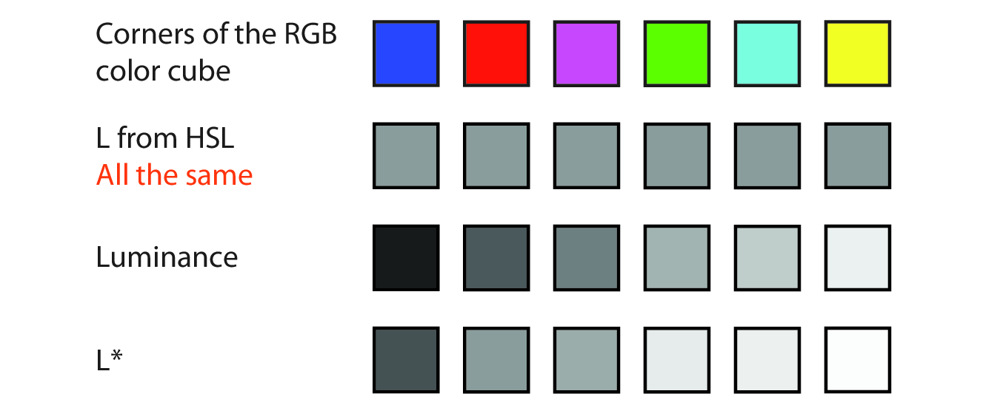
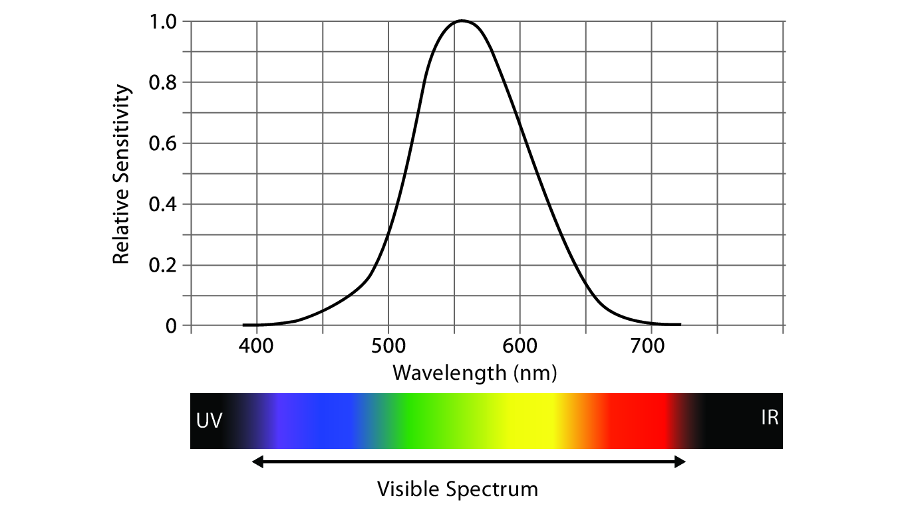
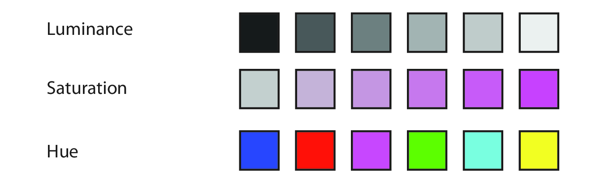
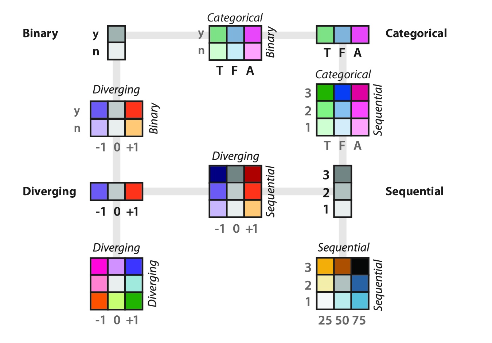

```{r, setup}
#| include: false

library(ggplot2)
library(dplyr)
library(patchwork)

```

## Color

:::: {.columns}

::: {.column width="50%"}

The beginning of this lecture is based on Chapter 10 of *Visualization Analysis & Design*.

</br>

"Map Color and Other Channels"

</br>

For this lecture, I'm going to start with some color theory from the *VAD* Text, incorporate a few other sources of information, then transition over to working with color in R.

:::

::: {.column width="50%"}  

{width=75% fig-align=right .lightbox}\
 
:::

::::

# Color Theory

## Color Vision

- Our eyes have two kinds of receptors:
  - **Rods**
    - Actively contribute to vision only in low-light settings.
    - Provide low-resolution black & white information.
  - **Cones**
    - Main sensors in normal lighting.
    - Three types of cones for different wavelengths.
    
## Color Vision

- Our visual system processes these signals into three **opponent color channels**:
  - One from red to green,
  - one from blue to yellow,
  - and one from black and white (luminance).
- The luminance channel provides high-resolution edge detection.
  - Red-green and blue-yellow channels are lower resolution.
- There is an important distinction between:
  - **Luminance** -- how bright or dark a color is.
  - **Chromaticity** -- what most people informally call "color".
  
## Color Vision

- **Color blindness**, more accurately termed **color deficiency**, affects a person's ability to distinguish color along one of the chormaticity channels.
- There are three types of color deficiency:
  - **Deuteranopia** and **protanopia**
    - Affect red-green channel.
    - Are sex-linked (~ 8% of men).
  - **Tritanopia**
    - Affects blue-yellow channel.
    - Extremely rare, not sex-linked.
    
## Color Spaces

- The **color space** of what we can detect is three-dimensional.
  - It can be adequately described by three orthogonal axes.
  - There are many ways to define these axes and convert between them.
  - Some color spaces are: 
    - convenient/commonly used (e.g., RGB)
    - designed to match our vision (e.g., HSL)
    
## RGB

- Red, green, blue.
- Computationally convenient.
- Not useful as separable channels; create an integral perception.
  - Additive color model.
  - Screens emit light.
- Not covered in the *VAD* textbook.

## RGB

- Device-dependent color model.
  - Colors can vary slightly between devices,
  - or on a device over time.
- TVs, cameras, scanners, video cameras, smartphones, etc.
- See the Wikipedia [RGB color model](https://en.wikipedia.org/wiki/RGB_color_model){target="_blank"} page.

## RGB

- Given as a triplet of red, green, blue values.
- May range from 0 -- 1.
- More commonly range from 0 -- 255.
- Often coded using two hexadecimal digits (0-9, A-F).
  - [Google color picker](https://share.google/yfMGf5dOXmwPaU4Yx){target="_blank"}
  
## CMYK

- Subtractive color model.
  - Inks absorb light.
- Cyan, magenta, yellow, black (= "key").
- Used in color printing.
- Not even mentioned in the *VAD* textbook.
- See the Wikipedia [CMYK color model](https://en.wikipedia.org/wiki/CMYK_color_model){target="_blank"} page.

## HSL/HSV

- HSL = Hue, saturation, lightness.
- HSV = Hue, saturation, grayscale value.
  - V is linearly related to L.
- More intuitive and heavily used by artists and designers.

## HSL

- **Hue** captures what we normally think of as "pure" colors.
  - E.g., red, blue, green, yellow, purple, etc.
  - *Not* white or black.
- **Saturation** captures the amount of white mixed with the color.
  - E.g., pink is desaturated red (more white mixed in).
- **Lightness** captures the amount of black mixed with the color.
  - E.g., controlling the darkness of a gray.
  
## HSL

- HSL is *pseudoperceptual*.
  - It doesn't truly reflect how we perceive color.

> "In particular, lightness *L* is wildly different from how we perceive luminance."

## HSL

<center>
{.lightbox width="60%"}
</center>

- Lightness is all the same here.
- True luminance is as measured with an instrument.
- L* is perceptually linear, the closest to what we see.

## HSL 

- Our perception of luminance depends on the wavelength of the light.
- Our **spectral sensitivity** curve for daylight vision is almost bell-shaped.

<center>
{.lightbox width="60%"}
</center>

## HCL

- Hue, chroma, luminance.
- Used to address perceptual issues with saturation.
- **Chroma** = "colorfulness".
- Not mentioned in the *VAD* textbook, but seems increasingly popular in the visualization world.

# Choosing Color Channels

## Choosing Color Channels

- Magnitude channels (ordered):
  - Luminance
  - Saturation
- Identity channels (categorical):
  - Hue
- Other channels (complementing the others):
  - Transparency
  
## Choosing Color Channels

- We automatically perceive luminance and saturation as ordered.
- We do not automatically perceive hue as ordered.

<center>
{.lightbox width="60%"}
</center>
  
## Magnitude Channels

- **Luminance** is suitable for ordered data.
- We have low accuracy in perceiving luminance of noncontiguous regions.
  - Due to contrast effects.
- Number of discriminable bins is probably < 5 if the background is not uniform.
- Luminance contrast is very important for resolving fine details.
  - E.g., we can't read text without luminance contrast.
  - Hue and saturation are not important for this.
  - If we use the luminance channel for our data, we may not have it to use for other reasons.
  
## Magnitude Channels

- **Saturation** is also suitable for ordered data.
- Also has the low accuracy problem for noncontiguous regions.
- Number of discernable steps is around 3.
- Interacts strongly with size:
  - Small marks (e.g., points/lines) are harder to discern.
  - Probably only want to use two saturation bins for small marks.
  
## Identity Channels

- **Hue** is appropriate for categorical data.
- Hue is the highest ranked channel for categorical data after spatial position.
- Also hard to make small comparisons in noncontiguous regions.
- Also harder to distinguish in smaller marks.

## Other Channels 

- **Transparency** is a fourth available channel.
- It interacts strongly with luminance and saturation and should not be used in conjunction with those two.
- It can be used with hue for a small number of bins, often two.
- Most often used with superimposed layers.
  - Create a foreground layer distinguishable from the background.
- Frequently used *redundantly*.
  - Same information also in another channel.
  
# Colormaps

## Colormaps

- **Colormaps** specify the mapping between colors and data values.
  - AKA, **pseudocoloring** or **color ramps**.
- Mostly use a combination of hue, saturation, and luminance to encode data.
  - Rather than using the three independently as different channels.

## Colormaps

:::: {.columns}

::: {.column width="30%"}
- **Categorical**
- **Ordered**
  - **Sequential**
  - **Diverging**
  
:::

::: {.column width="70%"}

<center>
{.lightbox width="95%"}
</center>

:::

::::

## Colormaps

- Colormaps can be continuous or segmented.

```{r}

cont_dat <- data.frame(x = seq(0, 1, length.out = 200), y = 1)

disc_dat <- data.frame(x = seq(0, 6, by = 1), y = 1)

thm <- theme_minimal() +
  theme(legend.position = "none",
        axis.title = element_blank(),
        axis.text = element_blank())

cp <- ggplot(cont_dat, aes(x = x, y = y, fill = x)) +
  geom_raster() +
  coord_cartesian(expand = FALSE) +
  scale_fill_viridis_c(option = "H") +
  ggtitle("Continuous") +
  thm

dp <- ggplot(disc_dat, aes(x = x, y = y, fill = x)) +
  geom_raster() +
  coord_cartesian(expand = FALSE) +
  scale_fill_viridis_c(option = "H") +
  ggtitle("Segmented (discrete)") +
  thm

cp/dp

```

## Colormaps

- ColorBrewer is a good source for colormaps:

<center>
[colorbrewer2.org](https://colorbrewer2.org){target="_blank"}.
</center>

- Easily accessible in R with `RColorBrewer`.

```{r}

cont_dat <- data.frame(x = seq(0, 1, length.out = 200), y = 1)

disc_dat <- data.frame(x = seq(0, 6, by = 1), y = 1)

thm <- theme_minimal() +
  theme(legend.position = "none",
        axis.title = element_blank(),
        axis.text = element_blank())

csp <- ggplot(cont_dat, aes(x = x, y = y, fill = x)) +
  geom_raster() +
  coord_cartesian(expand = FALSE) +
  scale_fill_distiller(type = "seq") +
  ggtitle("Continuous, sequential (Color Distiller)") +
  thm

cdp <- ggplot(cont_dat, aes(x = x, y = y, fill = x)) +
  geom_raster() +
  coord_cartesian(expand = FALSE) +
  scale_fill_distiller(type = "div") +
  ggtitle("Continuous, diverging (Color Distiller)") +
  thm

dp <- ggplot(disc_dat, aes(x = x, y = y, fill = factor(x))) +
  geom_raster() +
  coord_cartesian(expand = FALSE) +
  scale_fill_brewer(type = "qual") +
  ggtitle("Segmented (Color Brewer)") +
  thm

csp/cdp/dp

```

## Colormaps

- `viridis` was created to have perceptual advantages.
- It was created for R and has since been ported to other places.
- Check out the [viridis website](https://sjmgarnier.github.io/viridis/){target="_blank"}.
- The [`viridis` vignette](https://cran.r-project.org/web/packages/viridis/vignettes/intro-to-viridis.html){target="_blank"} is a good source of information about the various colormaps.

```{r}

cont_dat <- data.frame(x = seq(0, 1, length.out = 200), y = 1)

disc_dat <- data.frame(x = seq(0, 6, by = 1), y = 1)

thm <- theme_minimal() +
  theme(legend.position = "none",
        axis.title = element_blank(),
        axis.text = element_blank())

csp <- ggplot(cont_dat, aes(x = x, y = y, fill = x)) +
  geom_raster() +
  coord_cartesian(expand = FALSE) +
  scale_fill_viridis_c() +
  ggtitle("Continuous") +
  thm

cdp <- ggplot(cont_dat, aes(x = x, y = y, fill = x)) +
  geom_raster() +
  coord_cartesian(expand = FALSE) +
  scale_fill_viridis_c(option = "H") +
  ggtitle("Continuous, rainbow") +
  thm

dp <- ggplot(disc_dat, aes(x = x, y = y, fill = factor(x))) +
  geom_raster() +
  coord_cartesian(expand = FALSE) +
  scale_fill_viridis_d(option = "magma") +
  ggtitle("Segmented (magma)") +
  thm

csp/cdp/dp

```

## Other Useful R Packages

- [`colorspace`](https://colorspace.r-forge.r-project.org/){target="_blank"}
- [`nationalparkcolors`](https://github.com/katiejolly/nationalparkcolors){target="_blank"}
- [`paletteer`](https://github.com/EmilHvitfeldt/paletteer){target="_blank"} (a comprehensive collection of other palettes)

# Questions?

</br>

</br>


:::{style="font-size: 50%"}
[BCB5200 Home](https://bsmity13.github.io/BCB5200/)
:::
