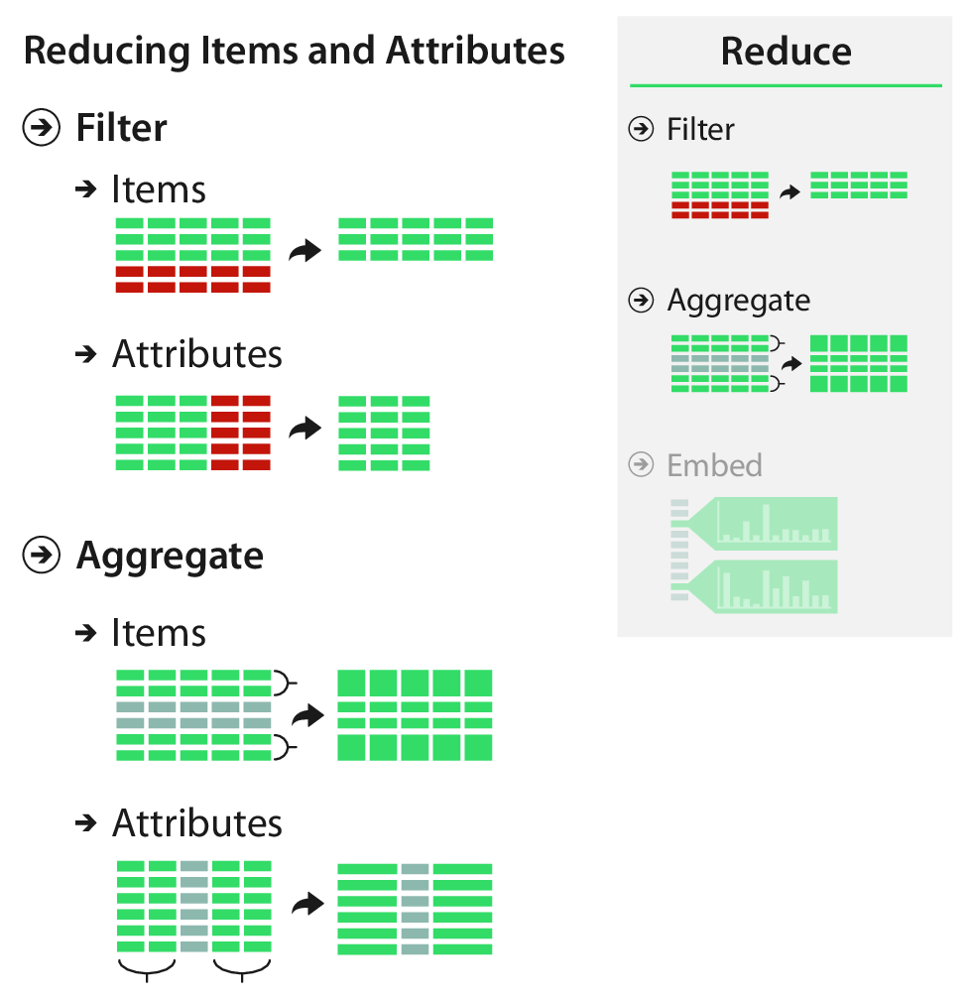
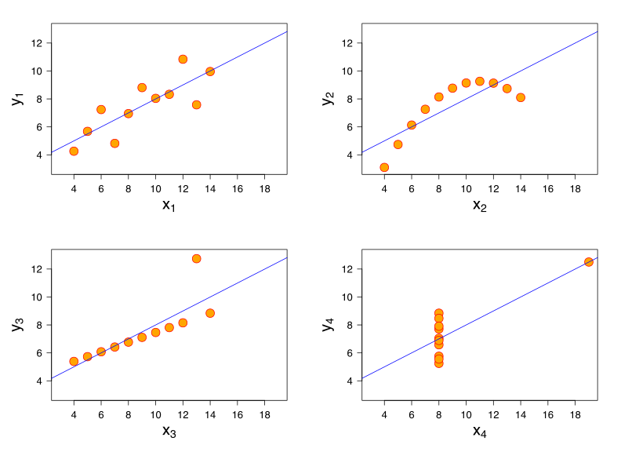

```{r, setup}
#| include: false

library(ggplot2)
library(dplyr)
library(patchwork)

```

## Reducing Items and Attributes

:::: {.columns}

::: {.column width="50%"}

The beginning of this lecture is based on Chapter 13 of *Visualization Analysis & Design*.

</br>

"Reduce Items and Attributes"

</br>

For this lecture, I'm going to start with the *VAD* Text, then transition over to R.

:::

::: {.column width="50%"}  

{width=75% fig-align=right .lightbox}\
 
:::

::::

---

<center>
{.lightbox width=60%}
</center>

## Reducing Items and Attributes

### Why?

- Manage complexity in our visualizations.
- Find a strategy that reduces the visual complexity while minimizing the changes of hiding important information from the user.

## Reducing Items and Attributes

### How?

- **Filter**:
  - Eliminating **elements** (*items* or *attributes*).
  - Easy to understand and compute.
  - But, "out of sight, out of mind."
- **Aggregate**:
  - Creating a new single **element** to replace multiple others.
  - Challenging to design and convey.
  - Safer cognitively to avoid forgetting filtered information.
  
## Filtering

- Straightfoward and intuitive.
  - Just don't show some things!
  - Common when exploring a new dataset.
- Plot only some attributes (columns).
  - Often based on knowledge of what the attributes represent.
- Plot only some items (rows).
  - Often based on values.
  - Sometimes based on a random subset.
  
## Filtering

### Attribute Filtering

- Often, we have an idea which attributes are most important to us.
  - Prioritize visualizations with those attributes.

```{r}
#| echo: true
#| code-fold: true
#| lightbox: true
#| fig-align: center

data("mtcars")

plot(mtcars)

```
  
## Filtering {.smaller}

### Attribute Filtering

- This may be combined with **attribute ordering**.
  - Orders attributes based on their **similarity**.
  - E.g., highly correlated attributes show some redundant information.
  
```{r}
#| echo: true
#| code-fold: true
#| lightbox: true
#| fig-align: center
#| warning: false
#| message: false

a <- mtcars %>% 
  ggplot(aes(x = disp, y = hp)) +
  geom_point() +
  geom_label(x = 150, y = 300, 
             label = paste("r =", 
                           round(cor(mtcars$disp, 
                                     mtcars$hp,
                                     method = "spearman"),
                                 2))) +
  geom_smooth(method = "lm", se = FALSE) +
  theme_classic()

b <- mtcars %>% 
  ggplot(aes(x = disp, y = mpg)) +
  geom_point() +
  theme_classic()

c <- mtcars %>% 
  ggplot(aes(x = hp, y = mpg)) +
  geom_point() +
  theme_classic()

des <- "AB
        AC"

a + b + c + plot_layout(widths = c(0.3, 0.7),
                        design = des)

```
  
## Filtering

### Item Filtering

- Filter items based on values.
  - E.g., remove outliers or extreme values.

```{r}
#| echo: true
#| code-fold: true
#| lightbox: true
#| fig-align: center

data("starwars")

a <- starwars %>% 
  ggplot(aes(x = height, y = mass)) +
  geom_point() +
  coord_cartesian(xlim = c(50, 250)) +
  ggtitle("Without Filtering") +
  theme_classic()

b <- starwars %>% 
  filter(mass < 500) %>% 
  ggplot(aes(x = height, y = mass)) +
  geom_point() +
  coord_cartesian(xlim = c(50, 250)) +
  ggtitle("Filter Extreme Values") +
  theme_classic()

a/b

```

## Filtering

### Item Filtering

- Randomly subset items.
  - Useful for (truly) big datasets where plotting all items would be difficult (impossible).
  
```{r}
#| echo: true
#| eval: false

# See ?dplyr::slice_sample

# Can specify number of items
mtcars %>% 
  slice_sample(n = 5)

# Can specify proportion of rows
mtcars %>% 
  slice_sample(prop = 0.1)
```

## Aggregation

- Creating a new derived element to represent the group.
  - Simple examples include summary statistics.
  - Remember Anscombe's Quartet!
  
<center>
{width=60% fig-align=center .lightbox}\
</center>

## Aggregation

### Item Aggregation

- Easily accomplished with idioms that:
  - Display summary statistics.
    - Mean, SD, etc. (moments)
    - Counts, densities
  - Show distributions.
  
## Aggregation

### Item Aggregation

#### 1D Summary Stats

```{r}
#| echo: true
#| code-fold: true
#| lightbox: true
#| fig-align: center
#| warning: false

a <- starwars %>% 
  filter(mass < 500) %>% 
  ggplot(aes(x = 0, y = mass)) +
  geom_point(show.legend = FALSE) +
  ggtitle("Without Aggregation") +
  labs(x = NULL, y = "Mass") +
  theme_classic() +
  theme(axis.text.x = element_text(angle = 45, hjust = 1))

b <- starwars %>%
  filter(mass < 500) %>% 
  ggplot(aes(y = mass)) +
  geom_boxplot(show.legend = FALSE) +
  ggtitle("Aggregate with Summary Stats (Boxplot)") +
  labs(x = NULL, y = "Mass") +
  theme_classic() +
  theme(axis.text.x = element_text(angle = 45, hjust = 1))

a/b

```

## Aggregation

### Item Aggregation

#### 2D Summary Stats

```{r}
#| echo: true
#| code-fold: true
#| lightbox: true
#| fig-align: center
#| warning: false

spp <- starwars %>% 
  filter(!is.na(species)) %>% 
  count(species) %>% 
  filter(n > 1)

sw <- starwars %>% 
  filter(species %in% spp$species) %>% 
  mutate(species = factor(species))

a <- sw %>% 
  ggplot(aes(x = species, y = mass, color = species)) +
  geom_point(show.legend = FALSE) +
  ggtitle("Without Aggregation") +
  labs(x = "Species", y = "Mass") +
  theme_classic() +
  theme(axis.text.x = element_text(angle = 45, hjust = 1))

b <- sw %>%
  ggplot(aes(x = species, y = mass, 
             color = species)) +
  geom_boxplot(show.legend = FALSE) +
  ggtitle("Aggregate by Species (Boxplot)") +
  labs(x = "Species", y = "Mass") +
  theme_classic() +
  theme(axis.text.x = element_text(angle = 45, hjust = 1))

a/b

```
  
## Aggregation

### Item Aggregation

#### 3D Summary Stats

```{r}
#| echo: true
#| code-fold: true
#| lightbox: true
#| fig-align: center
#| warning: false

# 'sw' created on previous slide

a <- sw %>% 
  ggplot(aes(x = height, y = mass, color = species)) +
  geom_point(show.legend = FALSE) +
  coord_cartesian(xlim = c(50, 250)) +
  ggtitle("Without Aggregation") +
  labs(x = "Height", y = "Mass") +
  theme_classic()

b <- sw %>% 
  group_by(species) %>% 
  summarize(mass_mean = mean(mass, na.rm = TRUE),
            mass_sd = sd(mass, na.rm = TRUE),
            height_mean = mean(height, na.rm = TRUE),
            height_sd = sd(height, na.rm = TRUE)) %>% 
  mutate(mass_lwr = mass_mean - mass_sd,
         mass_upr = mass_mean + mass_sd,
         height_lwr = height_mean - height_sd,
         height_upr = height_mean + height_sd) %>% 
  ggplot(aes(x = height_mean, y = mass_mean, 
             color = species)) +
  geom_errorbar(aes(xmin = height_lwr, xmax = height_upr),
                width = 5) +
  geom_errorbar(aes(ymin = mass_lwr, ymax = mass_upr),
                width = 2) +
  geom_point(size = 2) +
  coord_cartesian(xlim = c(50, 250)) +
  ggtitle("Aggregate by Species (mean +/- SD)") +
  labs(x = "Height", y = "Mass") +
  theme_classic()

a/b + plot_layout(guides = "collect")

```

## Aggregation

### Item Aggregation

#### 1D Counts/Densities

```{r}
#| echo: true
#| code-fold: true
#| lightbox: true
#| fig-align: center
#| warning: false

a <- starwars %>% 
  filter(mass < 500) %>% 
  ggplot(aes(y = 0, x = height)) +
  geom_point(show.legend = FALSE) +
  ggtitle("Without Aggregation") +
  labs(x = "Height", y = NULL) +
  theme_classic()

b <- starwars %>%
  filter(mass < 500) %>% 
  ggplot(aes(x = height)) +
  geom_histogram(bins = 15, color = "black", fill = "gray") +
  ggtitle("Aggregate with Counts (Histogram)") +
  labs(x = "Height", y = "Count") +
  theme_classic()

c <- starwars %>%
  filter(mass < 500) %>% 
  ggplot(aes(x = height)) +
  geom_density(color = "black", fill = "gray") +
  ggtitle("Aggregate with Density (KDE)") +
  labs(x = "Height", y = "Density") +
  theme_classic()

a/(b+c)

```

## Aggregation

### Item Aggregation

#### 2D Summary Stats

```{r}
#| echo: true
#| code-fold: true
#| lightbox: true
#| fig-align: center
#| warning: false

# 'sw' created on an earlier slide

a <- sw %>% 
  ggplot(aes(x = species, y = mass, color = species)) +
  geom_point(show.legend = FALSE) +
  ggtitle("Without Aggregation") +
  labs(x = "Species", y = "Mass") +
  theme_classic() +
  theme(axis.text.x = element_text(angle = 45, hjust = 1))

b <- sw %>%
  filter(!is.na(mass)) %>% 
  mutate(mass_bin = cut_number(mass, n = 5)) %>% 
  group_by(species, mass_bin) %>% 
  tally() %>% 
  ggplot(aes(x = species, y = mass_bin, 
             fill = n)) +
  geom_raster() +
  ggtitle("Aggregate with Counts (Heatmap)") +
  labs(x = "Species", y = "Mass") +
  scale_fill_viridis_c() +
  theme_classic() +
  theme(axis.text.x = element_text(angle = 45, hjust = 1))

a/b

```

## Aggregation

### Item Aggregation

#### 2D Summary Stats

```{r}
#| echo: true
#| code-fold: true
#| lightbox: true
#| fig-align: center
#| warning: false

# 'sw' created on an earlier slide

a <- sw %>% 
  ggplot(aes(x = height, y = mass)) +
  geom_point(show.legend = FALSE) +
  ggtitle("Without Aggregation") +
  labs(x = "Height", y = "Mass") +
  theme_classic()

b <- sw %>%
  filter(!is.na(mass)) %>% 
  ggplot(aes(x = height, y = mass)) +
  geom_density_2d_filled(show.legend = FALSE) +
  ggtitle("Aggregate with Density (2D KDE)") +
  labs(x = "Height", y = "Mass") +
  scale_fill_viridis_d() +
  theme_classic()

a/b

```
## Aggregation

### Attribute Aggregation

- Generally refered to as *dimensionality reduction* ([Wikipedia](https://en.wikipedia.org/wiki/Dimensionality_reduction){target="_blank"}).
- Goal is preserve meaningful structure while using fewer attributes.
- Sometimes, simple solutions exist.
- Mostly involves complex mathematics.

## Aggregation {.smaller}

### Attribute Aggregation

- Simple solution:

$$BMI = kg/m^2$$

```{r}
#| echo: true
#| code-fold: true
#| lightbox: true
#| fig-align: center
#| warning: false

# 'sw' created on previous slide

a <- sw %>% 
  ggplot(aes(x = height, y = mass, color = species)) +
  geom_point() +
  coord_cartesian(xlim = c(50, 250)) +
  ggtitle("Without Aggregation") +
  labs(x = "Height", y = "Mass") +
  theme_classic()

b <- sw %>% 
  mutate(bmi = mass/(height^2)) %>% 
  ggplot(aes(x = species, y = bmi, 
             color = species)) +
  geom_boxplot(show.legend = FALSE) +
  ggtitle("Aggregate with BMI") +
  labs(x = "Species", y = "BMI") +
  theme_classic() +
  theme(axis.text.x = element_text(angle = 45, hjust = 1))

a / b + plot_layout(guides = "collect")

```

## Aggregation {.smaller}

### Attribute Aggregation

:::: {.columns}

::: {.column}
- Complex methods include:
  - [Principal components analysis (PCA)](https://en.wikipedia.org/wiki/Principal_component_analysis)
  - [Multidimensional scaling (MDS)](https://en.wikipedia.org/wiki/Multidimensional_scaling){target="_blank"}
    - [Non-metric multidimensional scaling (NMDS)](https://en.wikipedia.org/wiki/Multidimensional_scaling#Non-metric_multidimensional_scaling_(NMDS))
  - [Linear discriminant analysis (LDA)](https://en.wikipedia.org/wiki/Linear_discriminant_analysis)
  - [Canonical correlation analysis (CCA)](https://en.wikipedia.org/wiki/Canonical_correlation_analysis)
  - Many others

:::

::: {.column}

<center>
{.lightbox}
</center>

:::

::::

## Aggregation {.smaller}

### Attribute Aggregation

#### PCA

```{r}
#| echo: true
#| code-fold: true
#| lightbox: true
#| fig-align: center
#| warning: false

# 'sw' created earlier; adding BMI here
sw <- sw %>% 
  mutate(bmi = mass/height^2)

pca <- prcomp(~ height + mass, data = sw)
pred <- predict(pca, sw)
sw$pc1 <- pred[, 1]

par(mfrow = c(1, 2))
biplot(pca)
summ <- summary(pca)
barplot(summ$importance[2, ],
        ylim = c(0, 1), ylab = "Proportion",
        main = "Variance Explained")
box()

```

## Aggregation {.smaller}

### Attribute Aggregation

#### PCA

```{r}
#| echo: true
#| code-fold: true
#| lightbox: true
#| fig-align: center
#| warning: false

# 'sw' created earlier
a <- sw %>% 
  ggplot(aes(x = height, y = bmi)) +
  geom_point() +
  labs(x = "Height", y = "BMI") +
  theme_classic()

b <- sw %>% 
  ggplot(aes(x = mass, y = bmi)) +
  geom_point() +
  labs(x = "Mass", y = "BMI") +
  theme_classic()

c <- sw %>% 
  ggplot(aes(x = pc1, y = bmi)) +
  geom_point() +
  labs(x = "PC1", y = "BMI") +
  ggtitle("Attribute Agg. with PCA") +
  theme_classic()

des <- "AC
        BC"

a + b + c + plot_layout(widths = c(0.4, 0.6),
                        design = des)

```


# Questions?

</br>

</br>


:::{style="font-size: 50%"}
[BCB5200 Home](https://bsmity13.github.io/BCB5200/)
:::
