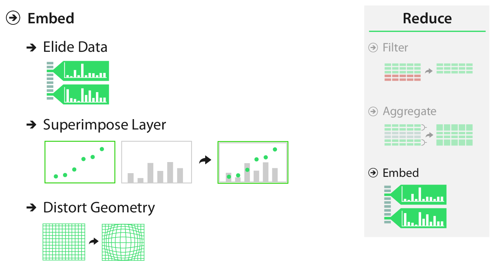
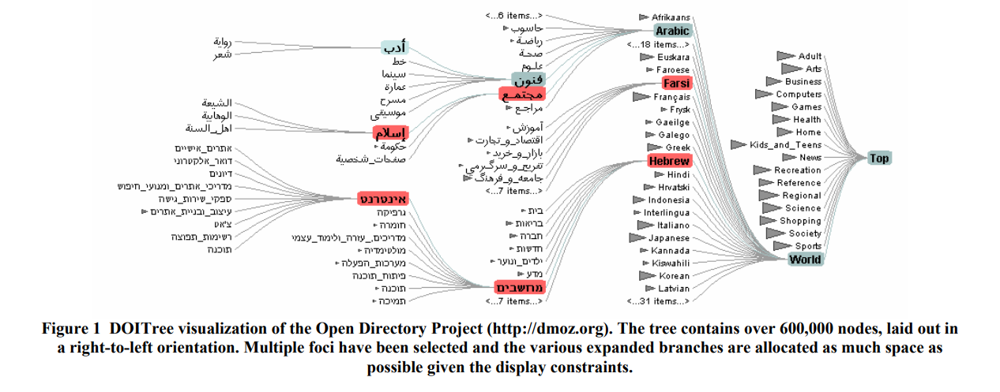

```{r, setup}
#| include: false

library(ggplot2)
library(dplyr)
library(patchwork)
library(tidyr)

```

## Reducing Items and Attributes

:::: {.columns}

::: {.column width="50%"}

The beginning of this lecture is based on Chapter 14 of *Visualization Analysis & Design*.

</br>

"Embed: Focus+Context"

</br>

For this lecture, I'm going to start with the *VAD* Text, then transition over to R.

:::

::: {.column width="50%"}  

{width=75% fig-align=right .lightbox}\

:::

::::

---

<center>
{.lightbox width=90%}
</center>

## Embed

### Why?

- Mitigate possibility of disorientation.
- Support orientation by providing context.
- Reduce cognitive load. ("Eyes beat memory")

## Embed

</br>

> "Embedding idioms cannot be fully understood when considered purely from the visual encoding point of view *or* purely from the interaction point of view; they are fundamentally a synthesis of both."

## Embed

### How?

- Elide
  - Selectively omit data.
- Superimpose
  - Plot data in layers.
- Distort geometry
  - To emphasize part of the view.

## Elide

- With **elision**, we (1) omit some items from the view completely, (2) summarize other items using aggregation, and (3) show some items in full detail.

```{r}
#| echo: true
#| code-fold: true
#| warning: false
#| message: false
#| fig-align: center
#| lightbox: true

library(ggforce)

data("starwars")

starwars %>% 
  filter(species %in% c("Human", "Droid", "Kaminoan", "Wookiee")) %>% 
  ggplot(aes(x = height, y = mass, color = species)) +
  ggforce::facet_zoom(x = species == "Human") +
  geom_point() +
  labs(x = "Height", y = "Mass") +
  theme_bw() +
  theme(text = element_text(size = 16))

```

## Elide

- A general framework for deciding which data to show is the **degree of interest (DOI)** function.
  - $DOI = I(x) - D(x, y)$
    - $I$ is an interest function. [(how much you want to see the item)]{style="font-size:18pt"}
    - $D$ is a distance function. [(how far it is from the selected item)]{style="font-size:18pt"}
    - $x$ is the location of the item.
    - $y$ is the current focus point.
  - Continuous function; often need to choose thresholds for omit/summarize/detail.

## Elide

### DOI functions

</br>

<center>
{.lightbox}

[[Heer and Card (2004)](http://vis.stanford.edu/papers/doitrees-revisited){target="_blank"}]{style="font-size:14pt;"}

</center>

## Superimpose

- Add layers to a visualization.
  - Can be global layers showing the entire dataset.
  - Can be local layers showing a zoomed view.

## Superimpose {.smaller}

### Global

- When units are the same, a single y-axis is not misleading.

```{r}
#| echo: true
#| code-fold: true
#| warning: false
#| message: false
#| fig-align: center
#| lightbox: true

url <- 'http://people.whitman.edu/~hundledr/courses/M250F03/LynxHare.txt'
lh <- read.table(url)
names(lh) <- c("year", "hare", "lynx")

lhp <- ggplot(lh, aes(x = year))  +
  geom_line(aes(y = hare, color = "Hare"), linewidth = 1.5) +
  geom_line(aes(y = lynx, color = "Lynx"), linewidth = 1.5) +
  coord_cartesian(ylim = c(0, NA)) +
  scale_color_discrete(name = "Population") +
  xlab("Year") +
  ylab("Population Size (thousands)") +
  ggtitle("Lynx-Hare Data") +
  theme_classic() +
  theme(text = element_text(size = 16))
lhp
```

## Superimpose {.smaller}

### Global

- When units differ (or are on a different scale), two y-axes can be misleading.

```{r}
#| echo: true
#| code-fold: true
#| warning: false
#| message: false
#| fig-align: center
#| lightbox: true

# Yellowstone northern range elk estimates
elk <- read.csv("data/elk_ssm_estimates_2025.csv") %>% 
  filter(winter %in% 1995:2019) %>% 
  mutate(elk = round(mean)) %>% 
  select(Year = winter, elk)

# Yellowstone northern range (only) wolf abundance
wolf <- read.csv("data/nr_wolf.csv") %>% 
  select(Year = year, wolf = nr_wolf)

# Combine
comb <- elk %>% 
  left_join(wolf, by = "Year")

# Plot on one axis
one_y <- comb %>% 
  pivot_longer(cols = elk:wolf,
               names_to = "Species",
               values_to = "Abundance") %>% 
  ggplot(aes(x = Year, y = Abundance, color = Species)) +
  geom_line(linewidth = 1.5) +
  ggtitle("One y-axis") +
  theme_bw() +
  theme(text = element_text(size = 16))

# Plot on two y-axes
two_y <- comb %>% 
  mutate(wolf = wolf * 200) %>% 
  pivot_longer(cols = elk:wolf,
               names_to = "Species",
               values_to = "Abundance") %>% 
  ggplot(aes(x = Year, y = Abundance, color = Species)) +
  geom_line(linewidth = 1.5) +
  scale_y_continuous(name = "Elk",
                     sec.axis = sec_axis(~ . * 2e-2, name = "Wolves")) +
  coord_cartesian(ylim = c(0, NA)) +
  ggtitle("Two y-axes") +
  theme_bw() +
  theme(text = element_text(size = 16))

# Combine
one_y/two_y + plot_layout(guides = "collect")

```

## Superimpose

### Local

- Particularly useful for interactive visualizations.
- Hides the data behind the superimposed layer.

```{r}
#| echo: true
#| message: false
#| warning: false
#| code-fold: true
#| fig-align: center
#| lightbox: true
#| fig-width: 14

lhp_zoom <- lhp +
  coord_cartesian(xlim = c(1880, 1900)) +
  ggtitle(NULL) +
  xlab(NULL) +
  ylab(NULL) +
  theme(text = element_text(size = 12),
        legend.position = "none",
        plot.background = element_rect(colour = "black", fill = "white", linewidth = 3))

lhp +
  inset_element(lhp_zoom, 0.15, 0.2, 0.85, 0.8)

```

## Superimpose

### Local

- See also the package [`ggmagnify`](https://github.com/hughjonesd/ggmagnify){target="_blank"}

```{r}
#| echo: true
#| message: false
#| warning: false
#| code-fold: true
#| fig-align: center
#| lightbox: true

# install.packages("ggmagnify", repos = c("https://hughjonesd.r-universe.dev", 
#                  "https://cloud.r-project.org"))
# install.packages("ggfx")

library(ggmagnify)
library(ggfx)

# Adapted from ?geom_magnify
ggp <- ggplot(iris, aes(Sepal.Width, Sepal.Length, 
                        color = Species)) +
         geom_point() + 
  xlim(c(2, 6)) +
  theme_bw() +
  theme(text = element_text(size = 16))
from <- list(2.5, 3.5, 6, 7)
to <- list(4, 6, 5, 7)

ggp + 
  geom_magnify(from = from, to = to, 
               shape = "ellipse",
               shadow = TRUE)
```

## Distort

- Geometric distortion can highlight a focal region.
- Important decisions:
  - How many focus regions? 
    - 1? More?
  - What shape is the focus?
    - Round? Rectangular? Other?
  - What is the extent of the focus?
    - Global? Local?
  - Will you use interaction? How?
    - E.g., magnifying glass, stretching a rubber sheet, etc.
    
## Distort

- Simplest case of distortion is a nonlinear transformation of the axes.

```{r}
#| echo: true
#| message: false
#| warning: false
#| code-fold: true
#| fig-align: center
#| lightbox: true

sw_linear <- starwars %>% 
  ggplot(aes(x = height, y = mass)) +
  geom_point(size = 2) +
  labs(x = "Height", y = "Mass") +
  theme_bw() + 
  ggtitle("Natural") +
  theme(text = element_text(size = 16))

sw_log <- sw_linear +
  scale_y_log10() +
  ggtitle("log-y")

sw_linear/sw_log
```

## Distort

- A popular distortion is the fisheye.
- I found an R Bloggers Post about this, but it doesn't seem to work well with a scatterplot.
  - [R Bloggers Post](https://www.r-bloggers.com/2024/12/fish-eye-lens-effect-with-ggplot2/){target="_blank"}
    - Here's a conceptual paper: [Keahey (1998)](https://web.archive.org/web/20010614151415id_/http://www.acl.lanl.gov:80/Viz/papers/ieee98/ieee.pdf){target="_blank"}
    - Here's an interactive example: [AntV fisheye](https://g2.antv.antgroup.com/en/manual/core/interaction/fisheye){target="_blank"}
  - It does seem to work well with network/spatial data.
    - [Sakar and Brown (1992)](https://www.cs.montana.edu/courses/spring2005/430/pg/ft_gateway.cfm.pdf){target="_blank"}
    - [Cartograms on the R Graph Gallery](https://r-graph-gallery.com/cartogram.html){target="_blank"}
    
## Distort

:::: {.columns}

::: {.column width=45%}

### Costs

- Distance and length judgements are severely impaired.
- Users may be unaware of distortion.
  - Especially without a distorted frame or gridlines.
- Requires cognitive load of **object constancy**.
  - Remembering an item in two different views is the same item.
:::

::: {.column width=10%}

:::

::: {.column width=45%}

### Benefits

- Shows the context and the focus in a single view.
- Avoids the need for faceting or reducing.
- Works well with:
  - Familiar shapes (e.g., cartograms)
  - Link-node relationships in networks.

:::

::::

# Embedding with R

## Elide

- Can be done with faceting.
  - E.g., `ggplot2::facet_wrap()`
- Can be done with a different view.
  - E.g., `patchwork`
  - E.g., `ggforce::facet_zoom()`
  
## Superimpose

- Can be done with multiple axes.
  - E.g., `ggplot2::scale_y_continuous(..., sec.axis = sec_axis(...))`
- Can be done with an inset panel.
  - E.g., `patchwork::inset_element()`
  - E.g., `ggmagnify::geom_magnify()`
  - E.g., `ggmapinset::geom_inset_frame()` (for maps)
  
## Distort

- Can be done by transforming axes.
  - E.g., `ggplot2::coord_transform()`
  - *I wish it could show untransformed gridlines.*
- `ggplot2` doesn't seem very amenable to this, but custom transforms can be done prior to plotting.


# Questions?

</br>

</br>


:::{style="font-size: 50%"}
[BCB5200 Home](https://bsmity13.github.io/BCB5200/)
:::
