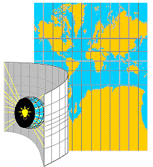
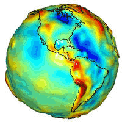

# Geographic Information Systems (GIS)

## Geographic Information Systems (GIS)

</br>

- GIS is a broad term for the data and tools we use to work in geographic space.

## Geographic Information Systems (GIS)

- From [Esri](https://www.esri.com/en-us/what-is-gis/overview)

> GIS is a technology that is used to create, manage, analyze, and map all types of data.

## Geographic Information Systems (GIS)

- From [Wikipedia](https://en.wikipedia.org/wiki/Geographic_information_system)

> A geographic information system (GIS) consists of integrated computer hardware and software that store, manage, analyze, edit, output, and visualize geographic data.

## Geographic Information Systems (GIS)

- GIS is a large and complex field.
- Entire undergraduate and graduate degrees are related to this topic:
  - [B.S. in Geographic Information Systems at U of I](https://www.uidaho.edu/academics/degree-finder/geographic-information-systems-bs)
  - [M.S. in Geographic Information **Science** at U of I](https://catalog.uidaho.edu/colleges-related-units/science/earth-spatial-sciences/geographic-information-science-ms/)
    - Note that GIScience is the academic discipline that studies GIS.
  - [Grad Cert in GIS](https://www.uidaho.edu/academics/degree-finder/geographic-information-systems-gr-cert)
  
<center>
*Today, we just want to scratch the surface on a few core ideas that will help us process and visualize spatial data.*
</center>

## Concepts in GIS

</br>

:::: {.columns}

::: {.column width=45%}

### Coordinate Reference Systems

- Geographic vs. projected
- Datum
- Referring to a CRS
  - EPSG Codes

:::

::: {.column width=5%}

:::

::: {.column width=45%}

### Spatial Data Types

- Vector
- Raster

<center>
[*These terms are not merely analogous to the image formats we talked about early in the semester -- they are identical.*]{style="font-size: 16pt;"}
</center>

:::

::::

## Coordinate Reference System (CRS)

> “A … coordinate reference system (CRS) is a framework used to precisely measure locations on, or relative to, the surface of Earth as coordinates. It is thus the application of the abstract mathematics of coordinate systems and analytic geometry to geographic space.”

--- [Wikipedia](https://en.wikipedia.org/wiki/Spatial_reference_system)

## Coordinate Reference System (CRS)

</br>

:::: {.columns}

::: {.column width=55%}

- Geographic Coordinate Systems
  - Treat the Earth as a spheroid (not flat).
    - Depends on the datum.
  - Expresses locations in units of degrees.
  - Latitude = N/S (y-coordinate).
  - Longitude = E/W (x-coordinate).
  

:::

::: {.column width=5%}

:::

::: {.column width=40%}


<center>
{.lightbox width=100%}\
</center>

:::

::::

## Coordinate Reference System (CRS)

:::: {.columns}

::: {.column width=55%}

- Projected Coordinate Systems
  - Project the round Earth onto a flat plane.
  - Planar coordinates obey properties of flat geometry
    - *E.g.*,
      - Parallel lines never meet
      - Angles of a triangle sum to 180°
      - $a^2 + b^2 = c^2$ holds (Pythagorean theorem)
  - Units are linear
    - Usually meters, sometimes feet

:::

::: {.column width=5%}

:::

::: {.column width=30%}

</br>

<center>
{.lightbox width=100%}\
</center>

:::

::::

## Coordinate Reference System (CRS)

:::: {.columns}

::: {.column width=55%}

- Projected Coordinate Systems
  - Projections can be thought of as shining a light through the globe and tracing the resulting map on a flat surface.
    - Mostly a metaphor, although some simple projections literally work this way.


:::

::: {.column width=5%}

:::

::: {.column width=30%}

</br>

<center>
{.lightbox width=100%}\

[Originally from: [www.geography.hunter.cuny.edu/~jochen/GTECH361/lectures/lecture04/concepts/](https://www.geography.hunter.cuny.edu/~jochen/GTECH361/lectures/lecture04/concepts/)]{style="font-size: 10pt;"}


</center>

:::

::::

## Coordinate Reference System (CRS)

:::: {.columns}

::: {.column width=55%}

- Projected Coordinate Systems
  - Projections all come with tradeoffs, since the surface of the Earth is not truly flat.
    - *Something* must get distorted.
    - Often illustrated with the orange peel metaphor.

:::

::: {.column width=5%}

:::

::: {.column width=30%}

</br>

<center>
{.lightbox width=100%}\

{.lightbox width=100%}\

[[Esri Blog Post](https://www.esri.com/arcgis-blog/products/arcgis-pro/education/earth-peel)]{style="font-size: 16pt;"}

</center>

:::

::::

## Coordinate Reference System (CRS)

:::: {.columns}

::: {.column width=55%}

- Projected Coordinate Systems
  - No projection can preserve all the properties of a map.
    - Area
    - Shape
    - Direction
    - Bearing
    - Distance


:::

::: {.column width=5%}

:::

::: {.column width=30%}

</br>

<center>

{.lightbox width=100%}\

</center>

:::

::::

## Coordinate Reference System (CRS) {.smaller}

- The Wikipedia article on [map projections](https://en.wikipedia.org/wiki/Map_projection 
) has a lot of great details.

<center>
{width=50% .lightbox}\
{width=50% .lightbox}\
</center>

## Coordinate Reference System (CRS)

:::: {.columns}

::: {.column width=55%}

- Universal Transverse Mercator (UTM) projections.
  - Use the transverse Mercator projection, which has minimal distortion along the central meridian.
  - Minimizes distortion by using 60 different central meridians, defining 60 different “zones”.
  - Units are meters.


:::

::: {.column width=5%}

:::

::: {.column width=30%}

</br>

<center>
{width=90% .lightbox}\

{.lightbox width=90%}\

</center>

:::

::::

## Coordinate Reference System (CRS)

- Datums*
  - A datum is a model connecting coordinates to their location on Earth.
    - Horizontal datums measure position on the Earth’s surface.
    - Vertical datums measure height above an origin, such as mean sea level.
    - 3D datums combine both.
  - A datum sets the reference frame from which all measurements are made.

<center>

<hr>

[* *data* is the plural of *datum*; however, in this context, we’ve come to refer to more than one datum as datums.]{style="font-size: 20pt;"}

</center>

## Coordinate Reference System (CRS)

:::: {.columns}

::: {.column width=55%}

- Datums*
  - The most common datum today is WGS84, which defines both the reference frame and an ellipsoid of the Earth.
    - WGS84 is the standard that GPS relies on.
  - Other older datums are often region specific, e.g.:
    - NAD83
    - NAD27


:::

::: {.column width=5%}

:::

::: {.column width=30%}

</br>

<center>
{width=100% .lightbox}\

[NASA Gravity Map](https://svs.gsfc.nasa.gov/3655)

</center>

:::

::::

## Coordinate Reference System (CRS) {.smaller}

- A CRS is defined by many potential parameters. *E.g.*, UTM Zone 12N on the WGS84 datum:

```
PROJCRS["WGS 84 / UTM zone 12N",
    BASEGEOGCRS["WGS 84",
        ENSEMBLE["World Geodetic System 1984 ensemble",
            MEMBER["World Geodetic System 1984 (Transit)"],
            MEMBER["World Geodetic System 1984 (G730)"],
            MEMBER["World Geodetic System 1984 (G873)"],
            MEMBER["World Geodetic System 1984 (G1150)"],
            MEMBER["World Geodetic System 1984 (G1674)"],
            MEMBER["World Geodetic System 1984 (G1762)"],
            MEMBER["World Geodetic System 1984 (G2139)"],
            MEMBER["World Geodetic System 1984 (G2296)"],
            ELLIPSOID["WGS 84",6378137,298.257223563,
                LENGTHUNIT["metre",1]],
            ENSEMBLEACCURACY[2.0]],
        PRIMEM["Greenwich",0,
            ANGLEUNIT["degree",0.0174532925199433]],
        ID["EPSG",4326]],
    CONVERSION["UTM zone 12N",
        METHOD["Transverse Mercator",
            ID["EPSG",9807]],
        PARAMETER["Latitude of natural origin",0,
            ANGLEUNIT["degree",0.0174532925199433],
            ID["EPSG",8801]],
        PARAMETER["Longitude of natural origin",-111,
            ANGLEUNIT["degree",0.0174532925199433],
            ID["EPSG",8802]],
        PARAMETER["Scale factor at natural origin",0.9996,
            SCALEUNIT["unity",1],
            ID["EPSG",8805]],
        PARAMETER["False easting",500000,
            LENGTHUNIT["metre",1],
            ID["EPSG",8806]],
        PARAMETER["False northing",0,
            LENGTHUNIT["metre",1],
            ID["EPSG",8807]]],
    CS[Cartesian,2],
        AXIS["(E)",east,
            ORDER[1],
            LENGTHUNIT["metre",1]],
        AXIS["(N)",north,
            ORDER[2],
            LENGTHUNIT["metre",1]],
    USAGE[
        SCOPE["Navigation and medium accuracy spatial referencing."],
        AREA["Between 114°W and 108°W, northern hemisphere between equator and 84°N, onshore and offshore. Canada - Alberta; Northwest Territories (NWT); Nunavut; Saskatchewan. Mexico. United States (USA)."],
        BBOX[0,-114,84,-108]],
    ID["EPSG",32612]]

```

<center>

(this format for information about a CRS is called ["well-known text" (WKT)](https://en.wikipedia.org/wiki/Well-known_text_representation_of_coordinate_reference_systems).)

</center>

## Coordinate Reference System (CRS)

- All of that can be shortened to a single code. *E.g.*, UTM Zone 12N on the WGS84 datum:

```
EPSG:32612
```
- EPSG codes were developed by the “European Petroleum Specialist Group” to make sharing CRS information easier.
- The EPSG registry was made public in 1993 and has been used widely since.
- The EPSG is no longer a standalone organization, but the name has remained to avoid confusion.


## Coordinate Reference System (CRS)

:::: {.columns}

::: {.column}
- Some useful EPSG codes:

```{r}
#| echo: false

library(gt)
library(gtExtras)
library(dplyr)

epsg <- data.frame(Description = c("Lat/long, WGS84",
                                   "UTM Zone 10, WGS84",
                                   "UTM Zone 11, WGS84",
                                   "UTM Zone 10, NAD83",
                                   "UTM Zone 11, NAD83"),
                   Code = c(4326,
                            32610,
                            32611,
                            26910,
                            26911
                            ))

epsg %>% 
  gt() %>% 
  gt_theme_espn() %>% 
  tab_options(table.width = 600, 
              table.font.size = 30, 
              column_labels.font.size = 20)

```

:::

::: {.column}

<center>
{.lightbox width=90%}\
</center>

:::

::::

# Data Types

## Data Types

:::: {.columns}

::: {.column}
- Vector
  - Point, line, or polygon.
  - (Other less common classes exist).
  - Store coordinates of vertices and their attributes.

:::

::: {.column}

<center>

```{r}
#| echo: false
#| fig-width: 6
#| fig-height: 8
#| fig-align: center
#| lightbox: true

library(ggplot2)
library(patchwork)

thm <- theme(#rect = element_rect(color = "black", linewidth = 2),
             plot.title = element_text(hjust = 0.5, size = 24))

pts <- data.frame(x = c(0, 1, 5, 7),
                  y = c(1, 0, 3, 2)) %>% 
  ggplot(aes(x = x, y = y)) +
  geom_point(size = 5) +
  coord_cartesian(xlim = c(-0.5, 7.5),
                  ylim = c(-1, 4)) +
  ggtitle("Points") +
  theme_void() +
  thm

lines <- data.frame(x = c(0, 1, 5, 2, 4, 6),
                    y = c(3, 2, 1.5, 4, 3, 3.3),
                    z = c(1, 1, 1, 2, 2, 2)) %>% 
  ggplot(aes(x = x, y = y, group = z)) +
  geom_point(size = 3) +
  geom_line(linewidth = 1) +
  coord_cartesian(xlim = c(-1, 7),
                  ylim = c(1, 5)) +
  ggtitle("Lines") +
  theme_void() +
  thm

polys <- data.frame(x = c(0, 1, 3, 4, 2.9, 2, 
                          2, 4, 6),
                    y = c(1.5, 0.75, 0.5, 1.1, 2.9, 1.5, 
                          3, 4, 3.3),
                    z = c(1, 1, 1, 1, 1, 1, 
                          2, 2, 2)) %>% 
  ggplot(aes(x = x, y = y, group = z)) +
  geom_point(size = 3) +
  geom_polygon(linewidth = 1, fill = NA, color = "black") +
  coord_cartesian(xlim = c(-1, 7),
                  ylim = c(-1, 5)) +
  ggtitle("Polygons") +
  theme_void() +
  thm

pts/lines/polys
```

</center>

:::

::::

## Data Types

:::: {.columns}

::: {.column}

- Raster
  - Gridded data.
    - Most often square; sometimes rectangular or hexagonal.
  - Often represent continuous values in discrete space.
  - Store coordinates of origin, cell dimensions, and values.
  
:::

::: {.column}

{.lightbox}\

:::

::::

# GIS in R

## GIS in R

:::: {.columns}

::: {.column width=45%}

- [`sf`](https://r-spatial.github.io/sf/)
  - "Simple features".
  - Primary R package for working with vector spatial data.
  - Replaced `sp` (same core developers).
  
  
<center>
{width=20%}\
</center>

:::

::: {.column width=5%}

:::

::: {.column width=45%}

- [`terra`](https://rspatial.github.io/terra/)
  - Primary R package for working with raster spatial data.
  - Replaced `raster` (same core developers).
  

<center>
{width=20%}\
</center>

:::

::::

## More GIS Resources

- [*Geocomputation with R*, e-book](https://r.geocompx.org/)
- [*Spatial Data Science*, e-book](https://r-spatial.org/book/)
- [*A Gentle Introduction to GIS*, by QGIS](https://docs.qgis.org/3.44/en/docs/gentle_gis_introduction/index.html)

# Questions?

</br>

</br>


:::{style="font-size: 50%"}
[BCB5200 Home](https://bsmity13.github.io/BCB5200/)
:::
