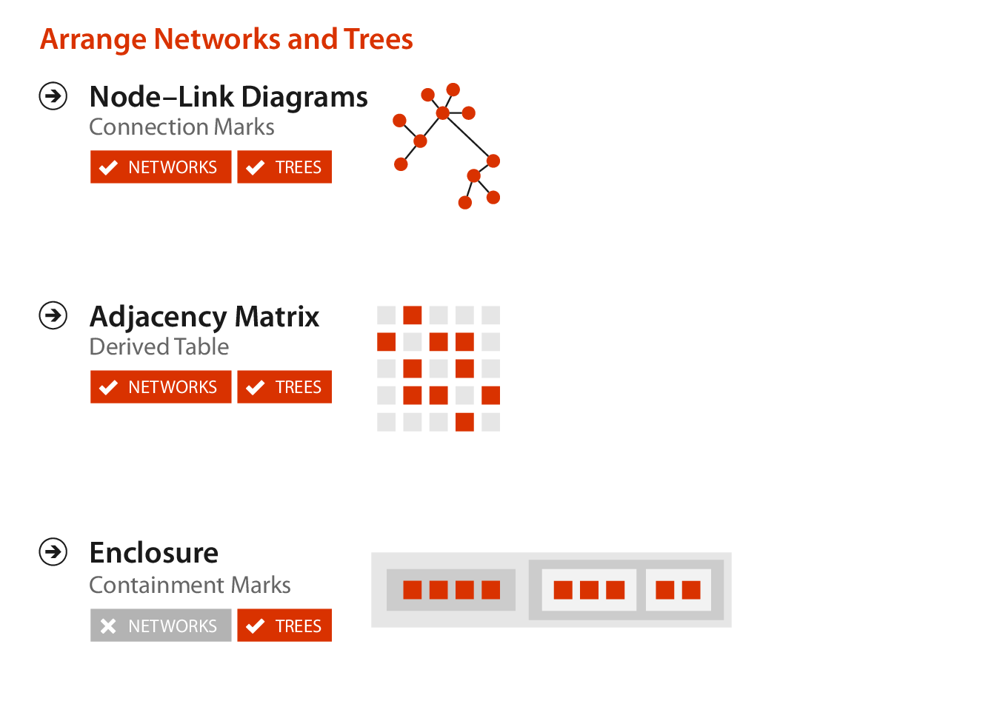
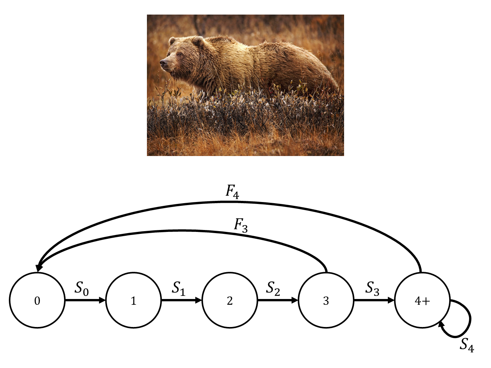

```{r setup}
#| echo: false

library(igraph)
library(ggraph) # also attaches required `ggplot2`
library(patchwork)
```

# Networks

## Networks

- Networks are mathematical structures containing **nodes** and **edges**.

```{r}
#| echo: true
#| code-fold: true
#| fig-align: center

# Create a random graph
set.seed(20260416)
g <- sample_gnm(60, 100) %>% 
  set_edge_attr(name = "weight",
                value = rexp(n = 100, rate = 0.9))

# Graph
ggraph(g, layout = "igraph", algorithm = "fr") +
  geom_edge_link(linewidth = 1) +
  geom_node_point(size = 5, color = "purple") +
  coord_equal() +
  theme_graph()
```

## Networks

- **Nodes** are the items in a network.
  - Other terms for a node:
    - **Vertex** 
    - **Point**
- **Edges** specify relations between nodes.
  - Other terms for an edge:
    - **Link**
    - **Connection**
    - **Arc**
    - **Line**
    
## Networks

- The branch of mathematics concerned with networks is known as [**graph theory**](https://en.wikipedia.org/wiki/Graph_theory).
  - Uses the term **graph** for a network.
  - Term dates back to [Sylvester (1878, *Nature*)](https://doi.org/10.1038%2F017284a0).
  
  
## Networks 

- Origins of graph theory date back to Leonhard Euler and the [Seven Bridges of Königsberg](https://en.wikipedia.org/wiki/Seven_Bridges_of_K%C3%B6nigsberg) problem.

<center>
{width=60% .lightbox}
</center>


## Networks

- **Nodes** can have attributes.

```{r}
#| echo: true
#| code-fold: true
#| fig-align: center

# Create a random graph
set.seed(20260416)
g <- sample_gnm(10, 12) %>% 
  set_vertex_attr(name = "size", value = rpois(n = 10, lambda = 3) + 1)

ggraph(g, layout = "auto") +
  geom_edge_link() +
  geom_node_point(aes(size = size, color = size)) +
  scale_color_viridis_c() +
  theme_graph()

```

## Networks

- **Edges** can have attributes.

```{r}
#| echo: true
#| code-fold: true
#| fig-align: center

# Create a random graph
set.seed(20260416)
g <- sample_gnm(8, 12) %>% 
  set_edge_attr(name = "size", value = rbinom(n = 12, size = 2, prob = 0.5))

ggraph(g, layout = "auto") +
  geom_edge_link(aes(linewidth = size, color = size)) +
  geom_node_point(size = 6) +
  theme_graph()

```

## Networks

- **Edges** can be undirected or directed.

```{r}
#| echo: true
#| code-fold: true
#| fig-align: center

# Create a graph
g1 <- make_graph(edges = c(1, 2, 2, 3, 3, 4),
                 directed = FALSE)

g2 <- make_graph(edges = c(1, 2, 2, 3, 3, 4),
                 directed = TRUE)

p1 <- ggraph(g1, layout = "linear") +
  geom_edge_link(linewidth = 1,
                 color = "purple") +
  geom_node_point(size = 6) +
  coord_flip() +
  ggtitle("Undirected") +
  theme_graph() +
  theme(plot.title = element_text(hjust = 0.5))

p2 <- ggraph(g2, layout = "linear") +
  geom_edge_link(linewidth = 1, arrow = arrow(angle = 30, 
                                               length = unit(0.2, "inches"),
                                               type = "closed"),
                  end_cap = circle(0.11, "inches"),
                  color = "purple") +
  geom_node_point(size = 6) +
  coord_flip() +
  ggtitle("Directed") +
  theme_graph() +
  theme(plot.title = element_text(hjust = 0.5))

p1 + p2

```


## Networks

- When an edge connects a node to itself, it is called a **loop**.

```{r}
#| echo: true
#| code-fold: true
#| fig-align: center

g <- make_graph(edges = c(1, 2, 2, 3, 3, 4, 4, 4),
                directed = TRUE)

ggraph(g, layout = "linear") +
  geom_edge_loop(linewidth = 1,
                arrow = arrow(angle = 30, 
                              length = unit(0.2, "inches"),
                              type = "closed"),
                end_cap = circle(0.11, "inches"), 
                color = "purple") +
  geom_edge_link(linewidth = 1,
                arrow = arrow(angle = 30, 
                              length = unit(0.2, "inches"),
                              type = "closed"),
                end_cap = circle(0.11, "inches"), 
                color = "purple") +
  geom_node_point(size = 6) +
  coord_cartesian(ylim = c(-0.5, 0.75)) +
  theme_graph()

```


## Networks

- Networks can have **cycles** where connections between nodes create a loop.
  - A network with at least one cycle is called **cyclic**,
  - and a network with no cycles is called **acyclic**.

```{r}
#| echo: true
#| code-fold: true
#| fig-align: center

# Create a graph
g1 <- make_graph(edges = c(1, 2, 2, 3, 3, 4),
                 directed = FALSE)

g2 <- make_graph(edges = c(1, 2, 2, 3, 3, 4, 4, 2),
                 directed = FALSE)

p1 <- ggraph(g1, layout = "linear") +
  geom_edge_link(linewidth = 1,
                 color = "purple") +
  geom_node_point(size = 6) +
  coord_flip() +
  ggtitle("Acyclic") +
  theme_graph() +
  theme(plot.title = element_text(hjust = 0.5))

p2 <- ggraph(g2, layout = "auto") +
  geom_edge_link(linewidth = 1, 
                  color = "purple") +
  geom_node_point(size = 6) +
  coord_flip() +
  ggtitle("Cyclic") +
  theme_graph() +
  theme(plot.title = element_text(hjust = 0.5))

p1 + p2

```

## Networks

- A network with hierarchical structure is called a **tree**.
- Trees cannot have cycles.

```{r}
#| echo: true
#| code-fold: true
#| fig-align: center

# Random graph
set.seed(20260416)
tr <- sample_tree(n = 30, directed = TRUE, method = "lerw")

ggraph(tr, layout = 'dendrogram') + 
  geom_edge_elbow(linewidth = 1) +
  theme_graph()
```

## Networks

- A **connected** network has some way to get between any two nodes.
- A **disconnected** graph has some gaps.

```{r}
#| echo: true
#| code-fold: true
#| fig-align: center

# Create a graph
g1 <- make_graph(edges = c(1, 2, 2, 3, 3, 4, 4, 2),
                 directed = FALSE)

g2 <- make_graph(edges = c(1, 2, 2, 3, 3, 4, 5, 6, 6, 7, 7, 5),
                 directed = FALSE)

p1 <- ggraph(g1, layout = "igraph", algorith = "fr") +
  geom_edge_link(linewidth = 1,
                 color = "purple") +
  geom_node_point(size = 6) +
  ggtitle("Connected") +
  theme_graph() +
  theme(plot.title = element_text(hjust = 0.5))

p2 <- ggraph(g2, layout = "igraph", algorith = "fr") +
  geom_edge_link(linewidth = 1, 
                  color = "purple") +
  geom_node_point(size = 6) +
  ggtitle("Disconnected") +
  theme_graph() +
  theme(plot.title = element_text(hjust = 0.5))

p1 + p2

```

## Networks

- A **connected** network might have a node or edge that acts as a bottleneck. If that node/edge is removed, the network becomes **disconnected**.
  - **Cut node** or **cut edge**.

```{r}
#| echo: true
#| code-fold: true
#| fig-align: center

# Create a graph
g1 <- make_graph(edges = c(1, 2, 2, 3, 3, 1, 
                           # Node 4 is cut node
                           3, 4, 4, 5,
                           5, 6, 6, 7, 7, 5),
                 directed = FALSE) %>% 
  set_vertex_attr(name = "cut", value = c((1:7) == 4))

g2 <- make_graph(edges = c(1, 2, 2, 3, 3, 1, 
                           # Cut vertex between 3 and 4
                           3, 4,
                           4, 5, 5, 6, 6, 7, 7, 4),
                 directed = FALSE) %>% 
  set_edge_attr(name = "cut", value = c((1:8) == 4))

p1 <- ggraph(g1, layout = "igraph", algorith = "fr") +
  geom_edge_link(linewidth = 1,
                 color = "black") +
  geom_node_point(size = 7, aes(color = cut)) +
  ggtitle("Cut Node") +
  theme_graph() +
  theme(plot.title = element_text(hjust = 0.5))

p2 <- ggraph(g2, layout = "igraph", algorith = "fr") +
  geom_edge_link(linewidth = 1, aes(color = cut)) +
  geom_node_point(size = 6) +
  ggtitle("Cut Edge") +
  theme_graph() +
  theme(plot.title = element_text(hjust = 0.5))

p1 + p2

```

# Visualizing Networks

## Visualizing Networks


:::: {.columns}

::: {.column width="50%"}

This part of the lecture is largely based on Chapter 9 of *Visualization Analysis & Design*.

</br>

"Arrange Networks and Trees"

</br>

We'll take some ideas from the text and some other examples from the internet to talk about how to visualize networks.

:::

::: {.column width="50%"}  

{width=75% fig-align=right .lightbox}\

:::

::::

## Visualizing Networks

{.lightbox width=70%}

## Node-Link Diagrams

- **Node-link diagrams** are the most common visual encoding idiom for networks.
  - Point marks for nodes.
  - Line marks for links.
  - Vertical/horizontal position may or may not be used to encode any information.

```{r}
#| echo: false
#| fig-align: center

# Create a random graph
set.seed(20260416)
g <- sample_gnm(60, 100) %>% 
  set_edge_attr(name = "weight",
                value = rexp(n = 100, rate = 0.9))

# Graph
ggraph(g, layout = "igraph", algorithm = "fr") +
  geom_edge_link(linewidth = 1) +
  geom_node_point(size = 5, color = "purple") +
  coord_equal() +
  theme_graph()
```

## Node-Link Diagrams

{width=70% .lightbox}

## Node-Link Diagrams

:::: {.columns}

::: {.column}

- Example from WLF 2200: Principles of Ecology
- This network is known as a **life-cycle diagram** and the projection matrix associated with it is known as a **Leslie matrix**.
- Horizontal position encodes age.

:::

::: {.column}

<center>
{width=70% .lightbox}
</center>

:::

::::

## Node-Link Diagrams

- A **spindle diagram** shows phylogenetic relationships in a tree.
- Horizontal width (of edges) encodes taxonomic diversity.
- Vertical position encodes geological time.

<center>
{width=50% .lightbox}
</center>


## Node-Link Diagrams

- Trees can also be displayed with a radial layout.

<center>
#Horizontal_gene_transfer_and_rooting_the_tree_of_life)](https://upload.wikimedia.org/wikipedia/commons/1/11/Tree_of_life_SVG.svg){width=40% .lightbox}
</center>

## Node-Link Diagrams

- When spatial position is not used to encode an attribute, the **layout** of nodes can be arbitrary.
- Many potential algorithms for deciding the placement of nodes for visual aesthetics or readability.

## Node-Link Diagrams

- A popular layout idiom is [**force-directed placement**](https://en.wikipedia.org/wiki/Force-directed_graph_drawing).
  - Many variants on the basic idea.
  - Position nodes with a simulation of physical forces.
    - Nodes repel each other.
    - Edges act like springs to draw each other together.
  - Many algorithms are nondeterministic (stochastic).
  
## Matrix Views

- A network can be transformed into an **adjacency matrix**.
  - An $n \times n$ square matrix, where $n$ is the number of nodes.
- Visualization can be based on the matrix instead of using node-link diagrams.

```{r}
#| echo: true
#| code-fold: true
#| fig-align: center

# Create a graph
g1 <- make_graph(edges = c(1, 2, 2, 3, 3, 1, 
                           # Node 4 is cut node
                           3, 4, 4, 5,
                           5, 6, 6, 7, 7, 5),
                 directed = FALSE) %>% 
  set_vertex_attr(name = "cut", value = c((1:7) == 4))

mat <- g1 %>% 
  as.matrix() %>% 
  as.matrix
colnames(mat) <- 1:7
rownames(mat) <- 1:7

par(mfrow = c(1, 2))
plot(g1, main = "Node-Link Diagram")
image(mat, asp = 1, axes = FALSE, main = "Adjacency Matrix", lwd = 0.5)
axis(1, at = seq(0, 1, length.out = 7), labels = 1:7)
axis(2, at = seq(0, 1, length.out = 7), labels = 1:7)
box()

```

## Containment: Hierarchy Marks

- Another approach is to show hierarchical structure with containment rather than connection.
  - [Treemaps](https://r-graph-gallery.com/treemap.html)
  - [Circular packing](https://r-graph-gallery.com/315-hide-first-level-in-circle-packing.html)

# Networks in R

## Networks in R

- Some useful R packages:
  - [`igraph`](https://r.igraph.org/), go-to package for networks in R?
  - [`ggraph`](https://ggraph.data-imaginist.com/), extension of `ggplot2` for networks.
  - [`tidygraph`](https://tidygraph.data-imaginist.com/), a tidy API for network manipulation.
  - Others?
- R Graph Gallery
  - [Network graph](https://r-graph-gallery.com/network.html)

# Questions?

</br>

</br>


:::{style="font-size: 50%"}
[BCB5200 Home](https://bsmity13.github.io/BCB5200/)
:::
