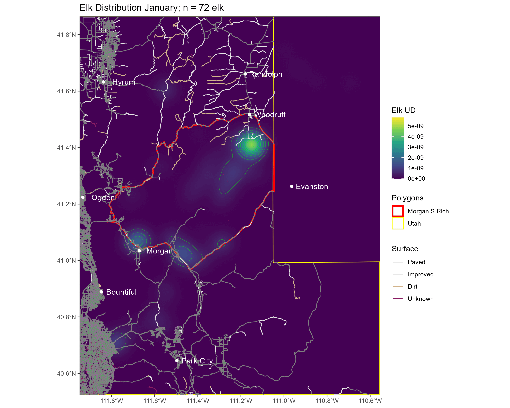

```{r setup}
#| echo: false

# Render start time
render_start <- Sys.time()

library(ggplot2)
library(patchwork)
library(gganimate)
library(dplyr)

```

# Animation

## Animation 

- Why animate?
  - Why **not** animate?
- What is an animation?
- Animation with `gganimate`
- Custom animation with `ImageMagick`

## Why not animate?

- "Eyes beat memory."
- Not available in print (obviously) or print-like media (e.g., PDF).
- Resource intensive.
- Interpolation between discrete states may be misleading.
  - Interpolated states aren't data.

## Why animate?

- Show different subsets of data.
- Show dynamics (usually over time, but other dimensions possible).
- Guide the eye to subtle changes.
- Build up a figure gradually.

## What is an animation?

- Set of frames that are displayed in sequence.
- Each frame is a static image.
  - Interpolation between static states can be useful for guiding the eye.
- Animation formats vary in their efficiency.
  - Some store 100% of the pixels of each frame.
    - High image quality, very large file size.
  - Others only store the changes from one frame to the next.
    - Significantly reduces file size.
    - Can introduce visual artifacts.
- Both image formats and video formats exist.
  - E.g., GIF is an image format.
  - E.g., MP4 is a video format.

# `gganimate`

## `gganimate`

<center>
[ {width=10%}\ ](https://gganimate.com/index.html)
</center>

- R package extending `ggplot2` for animation.

<center>

</center>

## `gganimate`

- The `gganimate` help files organize functions into these grammar classes:
  - Transitions
    - `transition_*()` defines how the items change.
  - Views
    - `view_*()` defines how the view changes.
  - Shadows
    - `shadow_*()` defines how items out-of-focus should appear.
  - Tweening
    - `enter_*()/exit_*()` defines how items come and go.
    - `ease_aes()` defines how different aesthetics should be eased during transitions.

## Transitions {.smaller}

- `transition_states()`
  - Transition between several distinct stages of the data
- `transition_time()`
  - Transition through distinct states in time
- `transition_reveal()`
  - Reveal data along a given dimension
- `transition_events()`
  - Transition individual events in and out
- `transition_filter()`
  - Transition between different filters
- `transition_layers()`
  - Build up a plot, layer by layer (literally the `ggplot2` layers)
- `transition_components()`
  - Define when each independent component enters and exits.

## Transitions

- `transition_states()`
  - Used to transition using discrete variables (*i.e.*, factors).
  - Think of this as an alternative to `facet_wrap()`.
    - *E.g.*, we made this figure in [Lecture 12](12_views.qmd#faceting-with-ggplot2-2){target="_blank"}

```{r}
#| echo: true
#| code-fold: true
#| fig-align: center

set.seed(19)
p <- expand.grid(n = 1:20, label = LETTERS[1:3]) %>% 
  mutate(x = rnorm(nrow(.))) %>% 
  ggplot(aes(x = x)) +
  geom_density(fill = "lavender") +
  facet_wrap(~ label)
p
```

## Transitions

- `transition_states()`
  - Animate rather than facet:

``` {r}
#| echo: true
#| code-fold: true
#| fig-align: center
#| eval: true

p +
  facet_null() +
  transition_states(label,
                    transition_length = 1,
                    state_length = 2) +
  labs(title = "{closest_state}")

```

## Transitions

- `transition_time()`
  - Used to transition using continuous variables (e.g., time).
  - An alternative to showing a classic timeseries.

```{r}
#| echo: true
#| code-fold: true
#| fig-align: center

p <- airquality %>% 
  mutate(Date = lubridate::ymd(paste0("1973-", Month, "-", Day))) %>% 
  ggplot(aes(x = Date, y = Temp)) +
  geom_point(size = 2) +
  theme_bw()
p +
  geom_line()

```

## Transitions

- `transition_time()`
  - (Time shown redundantly with x-position)

``` {r}
#| echo: true
#| code-fold: true
#| fig-align: center
#| eval: true

p +
  transition_time(Date)

```

## Transitions

- `transition_reveal()`
  - Used to gradually reveal along a dimension.

``` {r}
#| echo: true
#| code-fold: true
#| fig-align: center
#| eval: true
#| warning: false
#| message: false

p +
  geom_line() +
  transition_reveal(Date)

```

## Transitions

- `transition_events()`
  - Gives you detailed control over when items enter and exit.
  - Let's animate the Billboard Top 100 artists.

``` {r}
#| echo: true
#| code-fold: false
#| fig-align: center
#| warning: false
#| message: false

# Data on Billboard Hot 100 songs
# 1960 - 2016
library(billboard)

data("wiki_hot_100s")

wiki_hot_100s <- wiki_hot_100s %>% 
  mutate(no = as.numeric(no),
         year = as.numeric(year))

head(wiki_hot_100s)

```

## Transitions

- `transition_events()`
  - Gives you detailed control over when items enter and exit.
  - Some data wrangling:

``` {r}
#| echo: true
#| code-fold: false
#| fig-align: center
#| warning: false
#| message: false

# Find those artists with at least 10 appearances
multi <- wiki_hot_100s %>% 
  count(artist) %>% 
  filter(n > 10)

# Subset data to just those
tens <- wiki_hot_100s %>% 
  filter(artist %in% multi$artist)

# Sort by earliest appearance
sorted <- tens %>% 
  group_by(artist) %>% 
  summarize(start = min(year)) %>% 
  arrange(start) %>% 
  # Pull vector of artist names
  pull(artist)

# Change artist to factor by date
tens <- tens %>% 
  mutate(artist = factor(artist, levels = sorted)) %>% 
  # Categorize number of song
  mutate(no_cat = case_when(
           no == 1 ~ "1",
           no == 2 ~ "2",
           no == 3 ~ "3", 
           no <= 10 ~ "Top 10",
           no <= 25 ~ "Top 25",
           no <= 50 ~ "Top 50",
           no <= 100 ~ "Top 100"
         )) %>% 
  # Factor
  mutate(no_cat = factor(no_cat, 
                         levels = c("1", "2", "3", "Top 10",
                                    "Top 25", "Top 50", "Top 100")))

# Create data.frame of first and last appearance
fl <- tens %>% 
  group_by(artist) %>% 
  summarize(first = min(year), last = max(year))

# Join
tens_fl <- tens %>% 
  left_join(fl, by = "artist")

```

## Transitions

- `transition_events()`
  - Gives you detailed control over when items enter and exit.
  - Static plot:

``` {r}
#| echo: true
#| code-fold: true
#| fig-align: center
#| lightbox: true
#| warning: false
#| message: false

# Plot
p <- ggplot(tens_fl, aes(x = year, y = artist, color = no_cat)) +
  geom_point(size = 2.5) +
  scale_color_viridis_d(name = "Ranking", direction = -1) +
  scale_x_continuous(breaks = seq(1960, 2016, by = 4)) +
  theme_bw() +
  theme(axis.text.x = element_text(angle = 90, hjust = 1),
        axis.text = element_text(size = 7))
p

```

## Transitions

- `transition_events()`
  - Gives you detailed control over when items enter and exit.
  - Animation that groups contemporaries together:

``` {r}
#| echo: true
#| code-fold: true
#| fig-align: center
#| lightbox: true
#| warning: false
#| message: false
#| eval: true

# Animate
p +
  transition_events(start = first, end = last,
                    enter_length = 1, exit_length = 2) +
  enter_appear() +
  exit_disappear()

```

## Transitions

- `transition_filter()`
  - Let's you use sequential filters to remove pieces of data.
  - Useful for gradually arriving at a relevant subset of data.
  
``` {r}
#| echo: true
#| code-fold: true
#| fig-align: center
#| lightbox: true
#| warning: false
#| message: false
#| eval: true

# Animate
p +
  transition_filter(transition_length = 1,
                    filter_length = 1,
                    `The 1960s` = year %in% 1960:1969,
                    `The 1970s` = year %in% 1970:1979,
                    `New Millenium` = year > 1999) +
  ggtitle(
    'Filter: {closest_filter}',
    subtitle = '{closest_expression}'
  ) +
  enter_appear() +
  exit_fade()

```

## Transition

- `transition_layers()`
  - Build-up an animation one layer at a time.
  - I.e., add each `geom` sequentially.
  
``` {r}
#| echo: true
#| code-fold: true
#| fig-align: center
#| lightbox: true
#| warning: false
#| message: false

# Plot penguins data
data("penguins")

p <- penguins %>% 
  ggplot() +
  geom_point(aes(x = bill_len, y = flipper_len, color = species)) +
  geom_smooth(aes(x = bill_len, y = flipper_len), 
              method = "lm", color = "gray30", linetype = "dashed") +
  geom_smooth(aes(x = bill_len, y = flipper_len, color = species),
              method = "lm") +
  coord_cartesian(xlim = c(30, 60),
                  ylim = c(170, 240)) +
  labs(x = "Bill Length (mm)",
       y = "Flipper Length (mm)") +
  theme_bw()

p  

```

## Transition

- `transition_layers()`
  - Build-up an animation one layer at a time.
  - I.e., add each `geom` sequentially.
  
``` {r}
#| echo: true
#| code-fold: true
#| fig-align: center
#| lightbox: true
#| warning: false
#| message: false
#| eval: true

# Animate
p +
  transition_layers()

```

## Transition

- `transition_components()`
  - Transitions individual "components" around the figure.
  - Each component has its own time column, so can enter and exit at any time.

``` {r}
#| echo: true
#| code-fold: false
#| fig-align: center
#| lightbox: true
#| warning: false
#| message: false

# Function sample data from a random walk.
rw <- function(id) {
  # Empty data.frame
  df <- data.frame(id = id, 
                   t = 1:30,
                   x = NA, y = NA)
  # Random starting location
  df$x[1] <- runif(1, min = -3, max = 3)
  df$y[1] <- runif(1, min = -3, max = 3)
  
  # Loop to "walk"
  for (t in 2:30) {
    df$x[t] <- df$x[t - 1] + rnorm(1)
    df$y[t] <- df$y[t - 1] + rnorm(1)
  }
  
  # Return
  return(df)
}

# Sample 3 individuals
set.seed(123456)
dat <- lapply(1:3, rw) %>% 
  bind_rows()

```

## Transition

- `transition_components()`
  - Transitions individual "components" around the figure.
  - Each component has its own time column, so can enter and exit at any time.

``` {r}
#| echo: true
#| code-fold: true
#| fig-align: center
#| lightbox: true
#| warning: false
#| message: false

dat %>% 
  group_by(id) %>% 
  mutate(xend = lead(x), yend = lead(y)) %>% 
  ggplot(aes(x = x, y = y, color = factor(id), group = factor(id))) +
  geom_point() +
  geom_segment(aes(xend = xend, yend = yend)) +
  theme_bw()

```

## Transition

- `transition_components()`
  - Transitions individual "components" around the figure.
  - Each component has its own time column, so can enter and exit at any time.

``` {r}
#| echo: true
#| code-fold: true
#| fig-align: center
#| lightbox: true
#| warning: false
#| message: false
#| eval: true

dat %>% 
  # Let ID 1 go all 30 timesteps
  # Only let ID 2 enter at t = 10
  # Have ID 3 go from t = 5 to 20
  filter(id == 1 | (id == 2 & t > 9) | (id == 3 & t %in% 5:20)) %>% 
  ggplot(aes(x = x, y = y, color = factor(id), group = factor(id))) +
  geom_point(size = 3) +
  theme_bw() +
  transition_components(time = t) +
  ggtitle("t = {frame_time}")

```

## Views

- Change the axes as the data change.
- `view_follow()`
  - Follow the data in each frame.
- `view_step()`
  - Follow the data in steps.
- `view_zoom()`
  - Zoom between states.
  
## Views

- `view_follow()`
  - Follow the data in each frame.
  
``` {r}
#| echo: true
#| code-fold: true
#| fig-align: center
#| lightbox: true
#| warning: false
#| message: false
#| eval: true

penguins %>% 
  filter(!is.na(bill_len),
         !is.na(flipper_len)) %>% 
  ggplot(aes(bill_len, flipper_len, color = species)) +
  geom_point() +
  theme_bw() +
  labs(x = "Bill Length (mm)", 
       y = "Flipper Length (mm)", 
       title = "{closest_state}") +
  transition_states(species, transition_length = 4, state_length = 1) +
  view_follow()

```
  
## Views
- `view_step()`
  - Follow the data in steps.
  
``` {r}
#| echo: true
#| code-fold: true
#| fig-align: center
#| lightbox: true
#| warning: false
#| message: false
#| eval: true

penguins %>% 
  filter(!is.na(bill_len),
         !is.na(flipper_len)) %>% 
  ggplot(aes(bill_len, flipper_len, color = species)) +
  geom_point() +
  theme_bw() +
  labs(x = "Bill Length (mm)", 
       y = "Flipper Length (mm)", 
       title = "{closest_state}") +
  transition_states(species, transition_length = 4, state_length = 1) +
  view_step(pause_length = 2, step_length = 1, nsteps = 3)

```
  
## Views
- `view_zoom()`
  - Zoom between states.
  - Does a combination of zooming and panning.
    - Controlled by argument `pan_zoom`.
  
``` {r}
#| echo: true
#| code-fold: true
#| fig-align: center
#| lightbox: true
#| warning: false
#| message: false
#| eval: true

penguins %>% 
  filter(!is.na(bill_len),
         !is.na(flipper_len)) %>% 
  ggplot(aes(bill_len, flipper_len, color = species)) +
  geom_point() +
  theme_bw() +
  labs(x = "Bill Length (mm)", 
       y = "Flipper Length (mm)", 
       title = "{closest_state}") +
  transition_states(species, transition_length = 4, state_length = 1) +
  view_zoom(pause_length = 1, step_length = 2, nsteps = 3)

```

## Shadows

- Define how data from other frames are shown.
- `shadow_wake()`
  - Show preceding frames with gradual falloff.
- `shadow_trail()`
  - A trail of evenly spaced old frames.
- `shadow_mark()`
  - Show original data as background marks.
  
## Shadows

- `shadow_wake()`
  - Show preceding frames with gradual falloff.
  
``` {r}
#| echo: true
#| code-fold: true
#| fig-align: center
#| lightbox: true
#| warning: false
#| message: false
#| eval: true

penguins %>% 
  filter(!is.na(bill_len),
         !is.na(flipper_len)) %>% 
  ggplot(aes(bill_len, flipper_len, color = species)) +
  geom_point() +
  theme_bw() +
  labs(x = "Bill Length (mm)", 
       y = "Flipper Length (mm)", 
       title = "{closest_state}") +
  transition_states(species, transition_length = 4, state_length = 1) +
  shadow_wake(wake_length = 0.1)

```

## Shadows

- `shadow_trail()`
  - A trail of evenly spaced old frames.
  
``` {r}
#| echo: true
#| code-fold: true
#| fig-align: center
#| lightbox: true
#| warning: false
#| message: false
#| eval: true

dat %>% 
  # Let ID 1 go all 30 timesteps
  # Only let ID 2 enter at t = 10
  # Have ID 3 go from t = 5 to 20
  filter(id == 1 | (id == 2 & t > 9) | (id == 3 & t %in% 5:20)) %>% 
  ggplot(aes(x = x, y = y, color = factor(id), group = factor(id))) +
  geom_point(size = 3) +
  theme_bw() +
  transition_components(time = t) +
  ggtitle("t = {frame_time}") +
  shadow_trail(max_frames = 3, alpha = 0.3)

```

## Shadows

- `shadow_mark()`
  - Show original data as background marks.
  
``` {r}
#| echo: true
#| code-fold: true
#| fig-align: center
#| lightbox: true
#| warning: false
#| message: false
#| eval: true

penguins %>% 
  filter(!is.na(bill_len),
         !is.na(flipper_len)) %>% 
  ggplot(aes(bill_len, flipper_len, color = species)) +
  geom_point() +
  theme_bw() +
  labs(x = "Bill Length (mm)", 
       y = "Flipper Length (mm)", 
       title = "{closest_state}") +
  transition_states(species, transition_length = 1, state_length = 1) +
  shadow_mark(past = TRUE, future = TRUE, colour = 'grey')

```


## Tweening

- Control how data enter/leave the animation.
- `enter_appear()`/`exit_disappear()` 
- `enter_fade()`/`exit_fade()` 
- `enter_grow()`/`exit_shrink()` 
- `enter_recolor()`/`exit_recolor()` 
- `enter_fly()`/`exit_fly()` 
- `enter_drift()`/`exit_drift()`

## Tweening

- `enter_appear()`/`exit_disappear()` 
- Default options for transitions.

``` {r}
#| echo: true
#| code-fold: true
#| fig-align: center
#| lightbox: true
#| warning: false
#| message: false
#| eval: true

penguins %>% 
  filter(!is.na(bill_len),
         !is.na(flipper_len)) %>% 
  ggplot(aes(bill_len, flipper_len, color = species)) +
  geom_point() +
  theme_bw() +
  labs(x = "Bill Length (mm)", 
       y = "Flipper Length (mm)", 
       title = "{closest_state}") +
  transition_states(species, transition_length = 1, state_length = 1) +
  enter_appear() +
  exit_disappear()

```

## Tweening

- `enter_fade()`/`exit_fade()` 

``` {r}
#| echo: true
#| code-fold: true
#| fig-align: center
#| lightbox: true
#| warning: false
#| message: false
#| eval: true

penguins %>% 
  filter(!is.na(bill_len),
         !is.na(flipper_len)) %>% 
  ggplot(aes(bill_len, flipper_len, color = species)) +
  geom_point() +
  theme_bw() +
  labs(x = "Bill Length (mm)", 
       y = "Flipper Length (mm)", 
       title = "{closest_state}") +
  transition_states(species, transition_length = 1, state_length = 1) +
  enter_fade() +
  exit_fade()

```

## Tweening

- `enter_grow()`/`exit_shrink()` 

``` {r}
#| echo: true
#| code-fold: true
#| fig-align: center
#| lightbox: true
#| warning: false
#| message: false
#| eval: true

penguins %>% 
  filter(!is.na(bill_len),
         !is.na(flipper_len)) %>% 
  ggplot(aes(bill_len, flipper_len, color = species)) +
  geom_point() +
  theme_bw() +
  labs(x = "Bill Length (mm)", 
       y = "Flipper Length (mm)", 
       title = "{closest_state}") +
  transition_states(species, transition_length = 3, state_length = 1) +
  enter_grow() +
  exit_shrink()

```

## Tweening

- `enter_recolor()`/`exit_recolor()` 

``` {r}
#| echo: true
#| code-fold: true
#| fig-align: center
#| lightbox: true
#| warning: false
#| message: false
#| eval: true

penguins %>% 
  filter(!is.na(bill_len),
         !is.na(flipper_len)) %>% 
  ggplot(aes(bill_len, flipper_len, color = species)) +
  geom_point() +
  theme_bw() +
  labs(x = "Bill Length (mm)", 
       y = "Flipper Length (mm)", 
       title = "{closest_state}") +
  transition_states(species, transition_length = 2, state_length = 1) +
  enter_recolor(color = "gray") +
  exit_recolor(color = "gray")

```

## Tweening

- `enter_fly()`/`exit_fly()` 

``` {r}
#| echo: true
#| code-fold: true
#| fig-align: center
#| lightbox: true
#| warning: false
#| message: false
#| eval: true

penguins %>% 
  filter(!is.na(bill_len),
         !is.na(flipper_len)) %>% 
  ggplot(aes(bill_len, flipper_len, color = species)) +
  geom_point() +
  theme_bw() +
  labs(x = "Bill Length (mm)", 
       y = "Flipper Length (mm)", 
       title = "{closest_state}") +
  transition_states(species, transition_length = 1, state_length = 1) +
  enter_fly(x_loc = 30, y_loc = 170) +
  exit_fly(x_loc = 60, y_loc = 230)

```

## Tweening

- `enter_drift()`/`exit_drift()` 

``` {r}
#| echo: true
#| code-fold: true
#| fig-align: center
#| lightbox: true
#| warning: false
#| message: false
#| eval: true

penguins %>% 
  filter(!is.na(bill_len),
         !is.na(flipper_len)) %>% 
  ggplot(aes(bill_len, flipper_len, color = species)) +
  geom_point() +
  theme_bw() +
  labs(x = "Bill Length (mm)", 
       y = "Flipper Length (mm)", 
       title = "{closest_state}") +
  transition_states(species, transition_length = 1, state_length = 1) +
  enter_drift(x_mod = 20) +
  exit_drift(y_mod = 100)

```

## Tweening

- You can combine multiple `enter_*()`/`exit_*()` effects.

``` {r}
#| echo: true
#| code-fold: true
#| fig-align: center
#| lightbox: true
#| warning: false
#| message: false
#| eval: true

penguins %>% 
  filter(!is.na(bill_len),
         !is.na(flipper_len)) %>% 
  ggplot(aes(bill_len, flipper_len, color = species)) +
  geom_point() +
  theme_bw() +
  labs(x = "Bill Length (mm)", 
       y = "Flipper Length (mm)", 
       title = "{closest_state}") +
  transition_states(species, transition_length = 2, state_length = 1) +
  # Two enter_*()
  enter_fade() + enter_grow() +
  # Two exit_*()
  exit_fly(x_loc = 7, y_loc = 40) + exit_recolor(color = "black")

```

# Custom Animations

## Custom Animations

- `gganimate` provides a ton of flexibility.
- But sometimes I envision a very specific animation and can't figure out how to implement it using `gganimate`.
- My solution?
  - Write my own frames and then animate them with `ImageMagick`.
  
## Custom Animations

<center>
{.lightbox}
</center>
  
## Custom Animations with `ImageMagick`

- I will show you the details in the R code.
- Basic idea:
  - Save frames in order, numbers for file names.
    - Use leading 0s to make sure alphabetical order matches numerical order.
  - Use simple terminal command to combine frames using `ImageMagick`.
  
## Custom Animations with `ImageMagick`

### File names with leading 0s

#### Base R

```{r}
#| echo: true
#| code-fold: false

formatC(1:10, width = 2, format = "d", flag = "0")
```

</br>

#### Tidyverse

```{r}
#| echo: true
#| code-fold: false

stringr::str_pad(1:10, width = 2, side = "left", pad = "0")
```

## Custom Animations with `ImageMagick`

### Terminal command for `ImageMagick`

```
magick -delay 20 folder/*.png anim_file.gif
```

- `magick` calls the program.
- `-delay 20` means display each frame for 20 milliseconds.
  - (Bigger numbers for slower animations)
- `folder/*.png` returns the filenames of all PNG files inside of `folder/` (relative to the current path in your terminal).
- `anim_file.gif` is the output file.

# Questions?

</br>

</br>


:::{style="font-size: 50%"}
[BCB5200 Home](https://bsmity13.github.io/BCB5200/)
:::

## Render time {.smaller}

```{r}
#| echo: false

# Render end time
render_end <- Sys.time()

# How long?
render_time <- difftime(render_end, render_start, units = "mins") %>% 
  as.numeric() %>% 
  round(2)

cat("Render took:", render_time, "minutes.")

```
